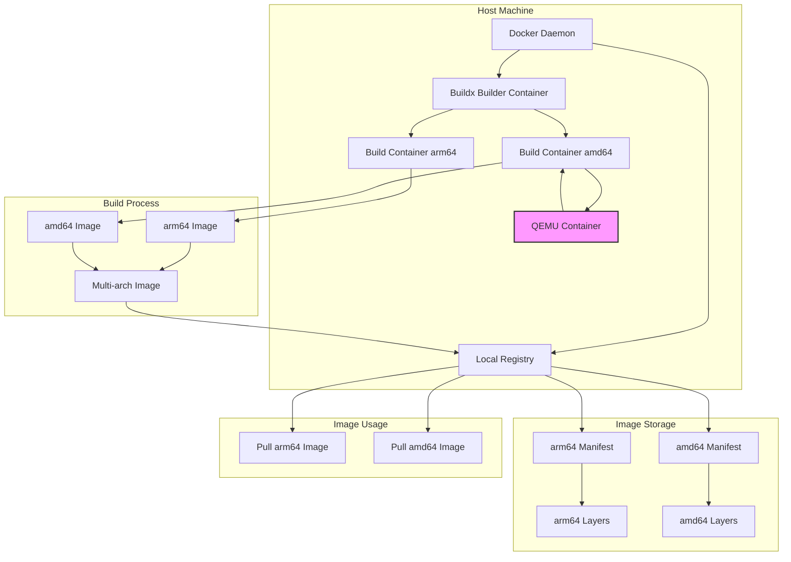
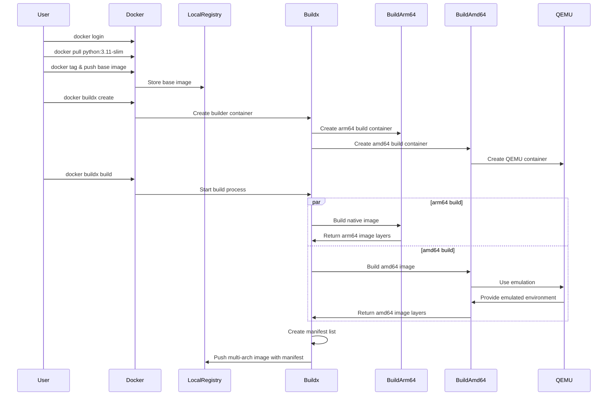

# Docker Buildx Multi-Architecture Example

This is a minimal project that demonstrates how to build multi-architecture Docker images using Docker Buildx. The project includes a simple Python application and a Dockerfile configured for multi-arch builds.

## Project Structure

```
.
├── Dockerfile          # Multi-arch Dockerfile
├── app.py             # Simple Python application
└── README.md          # This file
```

## Prerequisites

- Docker Desktop with Buildx support
- Docker Hub account (for pushing images)
- Local Docker registry (for testing)

## Architecture Overview



Note: The QEMU container (highlighted in pink) is only created when building for non-native architectures. For example, when building an amd64 image on an arm64 machine, the QEMU container provides the necessary emulation environment.

## Build Process Flow



## How QEMU Emulation Works

When building an AMD64 image on an ARM64 machine, the process works as follows:

1. **Binary Format Registration**:
   - The QEMU container registers binary formats in the host's `/proc/sys/fs/binfmt_misc/`
   - This tells the kernel how to handle AMD64 binaries on ARM64

2. **Build Process**:
   - The AMD64 build container provides a complete AMD64 environment
   - It manages the build context, layers, and Dockerfile instructions
   - When AMD64 binaries need to be executed:
     - The kernel intercepts the execution
     - Forwards it to QEMU in the QEMU container
     - QEMU emulates the AMD64 environment and executes the binaries
     - Results are returned to the build container

3. **Why Two Containers?**
   - **AMD64 Build Container**:
     - Provides a complete AMD64 environment
     - Manages build context and layers
     - Handles Dockerfile instructions
     - Maintains correct file system structure
     - Manages build dependencies and tools
   
   - **QEMU Container**:
     - Provides CPU emulation
     - Handles binary execution
     - Manages system call translation
     - Does not manage build environment

4. **Example Flow**:
   ```mermaid
   sequenceDiagram
       participant Build as AMD64 Build Container
       participant Kernel as Host Kernel
       participant QEMU as QEMU Container
       
       Build->>Kernel: Execute AMD64 binary
       Note over Build,Kernel: Build container manages environment
       Kernel->>QEMU: Forward execution
       QEMU->>QEMU: Emulate AMD64 environment
       QEMU->>Kernel: Return results
       Kernel->>Build: Return execution results
       Note over Build,Kernel: Build container continues build process
   ```

This separation of concerns allows:
- The build container to focus on managing the build environment and process
- The QEMU container to focus on CPU emulation
- Better isolation and reliability of the build process
- Proper handling of architecture-specific build requirements

## Dockerfile Explanation

The Dockerfile is configured to support multi-architecture builds using architecture-specific base images and a target-platform-based final stage:

```dockerfile
# Stage 1: Build for AMD64
FROM --platform=linux/amd64 localhost:5002/python:3.11-slim-amd64 AS amd64_builder
WORKDIR /build
RUN echo "Building for AMD64" > arch.txt
RUN echo "AMD64 specific build steps" > build.log
RUN echo "Hello from AMD64!" > message.txt

# Stage 2: Build for ARM64
FROM --platform=linux/arm64 localhost:5002/python:3.11-slim-arm64 AS arm64_builder
WORKDIR /build
RUN echo "Building for ARM64" > arch.txt
RUN echo "ARM64 specific build steps" > build.log
RUN echo "Hello from ARM64!" > message.txt

# Final stage: Combine results
FROM localhost:5002/python:3.11-slim-amd64 AS final_amd64
FROM localhost:5002/python:3.11-slim-arm64 AS final_arm64
FROM final_$TARGETARCH
WORKDIR /app

# Clean up any existing files first
RUN rm -rf /app/*

# Copy build artifacts from both architectures
COPY --from=amd64_builder /build/arch.txt /app/amd64_arch.txt
COPY --from=amd64_builder /build/message.txt /app/amd64_message.txt
COPY --from=arm64_builder /build/arch.txt /app/arm64_arch.txt
COPY --from=arm64_builder /build/message.txt /app/arm64_message.txt

# Copy and make the app executable
COPY app.py .
RUN chmod +x app.py

# Verify the contents of /app
RUN ls -la /app

# Set the entrypoint
ENTRYPOINT ["./app.py"]
```

### Key Features of the Multi-Stage Build:

1. **Architecture-Specific Base Images**:
   - Uses tagged base images for each architecture (`python:3.11-slim-amd64` and `python:3.11-slim-arm64`)
   - Ensures correct base image selection for each build stage
   - Prevents SHA256 hash confusion issues

2. **Platform-Specific Build Stages**:
   - `amd64_builder`: Runs on AMD64 platform with AMD64-specific base image
   - `arm64_builder`: Runs on ARM64 platform with ARM64-specific base image
   - Each stage can have its own build process and dependencies

3. **Dynamic Final Stage Selection**:
   - Creates separate final stages for each architecture
   - Uses `$TARGETARCH` to automatically select the correct final image
   - Ensures proper runtime environment for each platform

4. **Build Artifact Management**:
   - Cleans up target directory before copying files
   - Copies build artifacts from both architectures
   - Verifies file contents with directory listing
   - Maintains proper file permissions

---

这三行的含义以及最后一行 `FROM final_$TARGETARCH` 的作用如下：

### 三行代码的含义
```dockerfile
# Final stage: Combine results
FROM localhost:5002/python:3.11-slim-amd64 AS final_amd64
FROM localhost:5002/python:3.11-slim-arm64 AS final_arm64
FROM final_$TARGETARCH
```

1. **`FROM localhost:5002/python:3.11-slim-amd64 AS final_amd64`**
   - 定义了一个名为 `final_amd64` 的构建阶段，基于 `localhost:5002/python:3.11-slim-amd64` 镜像，用于 AMD64 架构的最终镜像。
   - 这一阶段为 AMD64 架构准备了一个基础镜像。

2. **`FROM localhost:5002/python:3.11-slim-arm64 AS final_arm64`**
   - 定义了一个名为 `final_arm64` 的构建阶段，基于 `localhost:5002/python:3.11-slim-arm64` 镜像，用于 ARM64 架构的最终镜像。
   - 这一阶段为 ARM64 架构准备了一个基础镜像。

3. **`FROM final_$TARGETARCH`**
   - 这一行使用了 Docker 构建时的架构变量 `$TARGETARCH`，动态选择最终镜像的基础阶段（`final_amd64` 或 `final_arm64`）。
   - `$TARGETARCH` 是一个在构建多架构镜像时由 Docker 自动设置的环境变量，表示目标架构（例如 `amd64` 或 `arm64`）。
   - 根据构建时的目标架构，Docker 会将 `final_$TARGETARCH` 解析为 `final_amd64` 或 `final_arm64`，从而选择对应的基础镜像。

### 为什么需要最后一行 `FROM final_$TARGETARCH`？
最后一行是实现 **多架构支持** 的关键。以下是具体原因：

1. **动态选择架构**：
   - Docker 的多架构构建（multi-architecture build）需要在同一个 Dockerfile 中支持不同的硬件架构（例如 AMD64 和 ARM64）。
   - 通过 `final_amd64` 和 `final_arm64` 定义了两个架构特定的构建阶段，但最终镜像需要根据目标平台动态选择其中一个。
   - `FROM final_$TARGETARCH` 使用 `$TARGETARCH` 变量来动态选择正确的阶段（`final_amd64` 或 `final_arm64`），确保最终镜像基于目标架构的正确基础镜像。

2. **支持 Docker BuildKit 的多架构构建**：
   - 当使用 Docker BuildKit（默认在现代 Docker 版本中启用）进行构建时，`--platform` 参数可以指定多个目标架构（例如 `linux/amd64,linux/arm64`）。
   - `$TARGETARCH` 变量会根据 `--platform` 的值自动设置为 `amd64` 或 `arm64`，从而让 Dockerfile 在构建时自动适配目标架构。
   - 没有 `FROM final_$TARGETARCH`，Docker 无法动态选择正确的最终镜像，导致无法生成多架构镜像。

3. **简化 Dockerfile 的逻辑**：
   - 直接使用 `FROM final_$TARGETARCH` 避免了为每种架构编写单独的 Dockerfile 或使用复杂的条件逻辑。
   - 它将架构选择交给 Docker 的构建系统，保持 Dockerfile 的简洁性和可维护性。

### 总结
- 这三行代码通过定义两个架构特定的最终阶段（`final_amd64` 和 `final_arm64`）并使用 `FROM final_$TARGETARCH` 来动态选择正确的阶段，实现了多架构镜像的构建。
- 最后一行 `FROM final_$TARGETARCH` 是必需的，因为它通过 `$TARGETARCH` 变量动态选择目标架构的基础镜像，确保构建的镜像与目标平台兼容。这是多架构 Dockerfile 的常见模式，特别是在使用 Docker BuildKit 构建多平台镜像时。

---

### Best Practices to Minimize Warnings

1. **Base Image Handling**:
   - Prepare architecture-specific base images:
     ```bash
     # Pull and tag AMD64 image
     docker pull --platform linux/amd64 python:3.11-slim
     docker tag python:3.11-slim localhost:5002/python:3.11-slim-amd64
     
     # Pull and tag ARM64 image
     docker pull --platform linux/arm64 python:3.11-slim
     docker tag python:3.11-slim localhost:5002/python:3.11-slim-arm64
     
     # Push to local registry
     docker push localhost:5002/python:3.11-slim-amd64
     docker push localhost:5002/python:3.11-slim-arm64
     ```
   - Use explicit platform specifications in build stages
   - Use `$TARGETARCH` for final stage selection
   - Maintain separate base images for each architecture in local registry

2. **Build and Test Process**:
   - Build multi-arch images with explicit platforms:
     ```bash
     docker buildx build --platform linux/amd64,linux/arm64 -t localhost:5002/multiarch-example:latest --push .
     ```
   - Test each architecture variant:
     ```bash
     # Test native architecture version
     docker run --rm localhost:5002/multiarch-example:latest
     
     # Test specific architecture version
     docker run --rm --platform linux/amd64 localhost:5002/multiarch-example:latest
     ```
   - Verify both architecture variants work correctly
   - Use `--push` flag to ensure proper image publishing

3. **Platform Selection and Variables**:
   - Use explicit platform specifications only in build stages
   - Let final stage inherit target platform through `$TARGETARCH`
   - Keep base images for all target platforms in local registry
   - Verify image functionality on all target architectures

## Architecture Compatibility

| Host Architecture | Compatible Variants |
|------------------|---------------------|
| arm64            | arm64/v8, arm64     |
| amd64            | amd64, x86_64       |
| arm/v7           | arm/v7, arm32       |

## Architecture Selection Process

When pulling and running a multi-architecture image, Docker automatically selects the appropriate architecture based on several factors:

### Automatic Architecture Selection

1. **Host Architecture Detection**
   ```mermaid
   sequenceDiagram
       participant User
       participant Docker
       participant Registry
       participant Host
       
       User->>Docker: docker pull multiarch-example:latest
       Docker->>Host: Detect system architecture
       Host-->>Docker: Return architecture (e.g., arm64)
       Docker->>Registry: Request manifest list
       Registry-->>Docker: Return manifest list
       Docker->>Docker: Match host architecture to manifest
       Docker->>Registry: Pull matching architecture image
       Registry-->>Docker: Return architecture-specific image
   ```

2. **Selection Process**
   - Docker first detects the host system's architecture
   - When pulling an image, it requests the manifest list
   - The manifest list contains all available architectures
   - Docker matches the host architecture with the available options
   - The matching architecture-specific image is pulled

3. **Fallback Behavior**
   - If exact architecture match isn't found, Docker looks for compatible variants
   - Example: `arm64` might use `arm64/v8` if available
   - If no compatible architecture is found, pull fails

### Manual Architecture Selection

You can override the automatic selection using the `--platform` flag:

```bash
# Force using amd64 architecture
docker run --platform linux/amd64 multiarch-example:latest

# Force using arm64 architecture
docker run --platform linux/arm64 multiarch-example:latest
```

## Step-by-Step Guide

### Step 1: Setup Local Registry with Manifest Support

1. Create a registry configuration file (`registry-config.yml`):
```yaml
version: 0.1
log:
  fields:
    service: registry
storage:
  cache:
    blobdescriptor: inmemory
  filesystem:
    rootdirectory: /var/lib/registry
http:
  addr: :5000
  headers:
    X-Content-Type-Options: [nosniff]
compatibility:
  schema1:
    enabled: true
  manifest:
    enabled: true
    allow:
      - application/vnd.docker.distribution.manifest.v2+json
      - application/vnd.docker.distribution.manifest.list.v2+json
      - application/vnd.oci.image.manifest.v1+json
      - application/vnd.oci.image.index.v1+json
```

2. Start the registry with manifest support:
```bash
# Start a local registry with manifest support (using port 5002)
docker run -d -p 5002:5000 --name registry \
    -v $(pwd)/registry-config.yml:/etc/docker/registry/config.yml \
    registry:2
```

### Step 2: Setup Buildx Builder

Create a Buildx builder that uses the Docker daemon directly:

```bash
# Create a new builder that uses the Docker daemon directly
docker buildx create --use --name mybuilder --driver docker-container --driver-opt network=host
```

### Step 3: Prepare Base Images

Before building the multi-arch image, prepare architecture-specific base images in the local registry:

```bash
# Pull and tag AMD64 image
docker pull --platform linux/amd64 python:3.11-slim
docker tag python:3.11-slim localhost:5002/python:3.11-slim-amd64
docker push localhost:5002/python:3.11-slim-amd64

# Pull and tag ARM64 image
docker pull --platform linux/arm64 python:3.11-slim
docker tag python:3.11-slim localhost:5002/python:3.11-slim-arm64
docker push localhost:5002/python:3.11-slim-arm64
```

### Step 4: Build and Push to Local Registry

Build and push the multi-architecture image to your local registry:

1. Build and push both architectures in a single command:
```bash
# Build and push both architectures
docker buildx build --platform linux/amd64,linux/arm64 \
    -t localhost:5002/multiarch-example:latest \
    --push --provenance=false --sbom=false .

# Verify the manifest list was created
docker buildx imagetools inspect localhost:5002/multiarch-example:latest
```

Note: The `--provenance=false --sbom=false` flags disable the generation of attestation manifests.

### Step 5: Verify the Build

After pushing to the local registry, verify the multi-architecture image:

1. Test the image on different architectures:
```bash
# Run on your native architecture
docker run --rm localhost:5002/multiarch-example:latest

# Run on AMD64 (will use emulation if not on AMD64 machine)
docker run --rm --platform linux/amd64 localhost:5002/multiarch-example:latest

# Run on ARM64 (will use emulation if not on ARM64 machine)
docker run --rm --platform linux/arm64 localhost:5002/multiarch-example:latest
```

The application will display:
- Python version
- Architecture information
- Platform details
- Build artifacts from both architectures

### Step 6: Push to Docker Hub

After verifying the multi-arch image works in the local registry, push it to Docker Hub:

1. Tag and push each architecture:
```bash
# For ARM64
docker pull --platform linux/arm64 localhost:5002/multiarch-example:latest
docker tag localhost:5002/multiarch-example:latest weli/multiarch-example:arm64
docker push weli/multiarch-example:arm64

# For AMD64
docker pull --platform linux/amd64 localhost:5002/multiarch-example:latest
docker tag localhost:5002/multiarch-example:latest weli/multiarch-example:amd64
docker push weli/multiarch-example:amd64
```

2. Create and push the manifest list:
```bash
# Create a manifest list that points to both architectures
docker manifest create weli/multiarch-example:latest \
    --amend weli/multiarch-example:amd64 \
    --amend weli/multiarch-example:arm64

# Push the manifest list
docker manifest push weli/multiarch-example:latest
```

3. Verify the manifest list:
```bash
# Check the manifest list
docker manifest inspect weli/multiarch-example:latest
```

Now, when users pull either `localhost:5002/multiarch-example:latest` or `weli/multiarch-example:latest`, Docker will automatically select the correct architecture based on their host platform.

### Step 7: Cleanup

When you're done, clean up the resources:

```bash
# Remove the Buildx builder
docker buildx rm mybuilder

# Stop and remove the local registry
docker stop registry
docker rm registry

# Remove the registry configuration
rm registry-config.yml
```

## Troubleshooting

### Build Cache Issues

If you encounter issues with stale artifacts or unexpected files in your image, it might be due to the build cache. Here's how to resolve such issues:

1. Clean the buildx cache:
   ```bash
   # Remove all buildx cache
   docker buildx prune -f
   ```

2. Rebuild without using cache:
   ```bash
   # Build with --no-cache flag
   docker buildx build --no-cache --platform linux/amd64,linux/arm64 -t localhost:5002/multiarch-example:latest --push .
   ```

3. Clean up local images and pull fresh:
   ```bash
   # Remove local image
   docker rmi -f localhost:5002/multiarch-example:latest
   
   # Pull fresh image
   docker pull localhost:5002/multiarch-example:latest
   ```

### Network Issues

If you encounter network issues when pushing directly to Docker Hub with Buildx, use this manual process:
1. Build the multi-arch image locally
2. Push to a local registry
3. Manually tag and push each architecture to Docker Hub
4. Verify the images can be pulled for each architecture

### Platform Mismatch Warnings

You might see warnings like:
```
WARN: InvalidBaseImagePlatform: Base image was pulled with platform "linux/arm64", expected "linux/amd64"
```
This warning is expected when building multi-architecture images and can be safely ignored if:
1. You're using a local registry
2. The final image works correctly on all target platforms
3. The build completes successfully

## Best Practices

1. **Clean Builds**:
   - Use `--no-cache` when troubleshooting build issues
   - Regularly clean buildx cache with `docker buildx prune`
   - Remove local images before testing fresh builds

2. **Image Verification**:
   - Always test images on all target architectures
   - Verify the contents and behavior of the final image
   - Check for any unexpected files or artifacts

3. **Local Registry Usage**:
   - Use a local registry for faster development and testing
   - Tag and push base images to local registry first
   - Test images locally before pushing to Docker Hub

### Platform Selection Warning

When running multi-architecture images, you might see a warning like:
```
WARNING: The requested image's platform (linux/amd64) does not match the detected host platform (linux/arm64/v8)
```

This warning appears when:
1. You're running on one architecture (e.g., ARM64/Apple Silicon)
2. Docker pulls the image variant for a different architecture (e.g., AMD64)
3. No specific platform was requested in the run command

To resolve this, explicitly specify the platform when running the container:

```bash
# Run using your host's native architecture
docker run --rm --platform linux/arm64 localhost:5002/multiarch-example:latest

# Force running AMD64 version (will use emulation if needed)
docker run --rm --platform linux/amd64 localhost:5002/multiarch-example:latest
```

The `--platform` flag tells Docker which version of the image to use:
- `linux/arm64`: Uses native ARM64 version (best performance on Apple Silicon/ARM machines)
- `linux/amd64`: Uses AMD64 version (might use emulation on ARM machines)

If you don't specify a platform:
1. Docker will try to use the image that matches your build platform
2. This might not be optimal for your host architecture
3. You'll see the warning message about platform mismatch

### Platform Variables in Multi-Architecture Builds

The Dockerfile uses two important platform-related variables:

1. **$BUILDPLATFORM**:
   - Represents the platform where the build is running
   - Often defaults to AMD64 in buildx environments
   - Used when you need to run build-time operations
   - Example: `FROM --platform=$BUILDPLATFORM golang:1.21` for a build stage

2. **$TARGETPLATFORM**:
   - Represents the platform for which the image is being built
   - Matches the actual target architecture (ARM64 or AMD64)
   - Used for the runtime image
   - Example: `FROM --platform=$TARGETPLATFORM python:3.11-slim` for the final stage
   - This is actually the default behavior, so `--platform=$TARGETPLATFORM` is optional

When using these variables:
- Use `$BUILDPLATFORM` for build stages that need to run during image creation
- Use `$TARGETPLATFORM` (or omit platform specification) for the final runtime stage
- This ensures Docker selects the correct architecture by default when running the container

For example, in our Dockerfile:
```dockerfile
# Build stages use specific platforms
FROM --platform=linux/amd64 python:3.11-slim AS amd64_builder
...
FROM --platform=linux/arm64 python:3.11-slim AS arm64_builder
...

# Final stage uses TARGETPLATFORM (or no platform specification)
FROM python:3.11-slim
# This automatically matches the running platform
```

This setup ensures that:
1. Build stages run on their specified platforms
2. The final image automatically matches your host architecture
3. No platform warning appears when running without `--platform` flag

### Common Build Warnings

When building multi-architecture images, you might encounter these warnings:

1. **Redundant Target Platform Warning**:
   ```
   WARN: RedundantTargetPlatform: Setting platform to predefined $TARGETPLATFORM in FROM is redundant
   ```
   - This occurs when you explicitly specify `--platform=$TARGETPLATFORM`
   - Solution: Remove the platform specification from the final stage
   - Example:
     ```dockerfile
     # Instead of:
     FROM --platform=$TARGETPLATFORM python:3.11-slim
     
     # Use:
     FROM python:3.11-slim
     ```

2. **Invalid Base Image Platform Warning**:
   ```
   WARN: InvalidBaseImagePlatform: Base image was pulled with platform "linux/arm64", expected "linux/amd64"
   ```
   - This occurs during multi-arch builds when the base image platform doesn't match the build stage
   - It's expected behavior and can be safely ignored when:
     - You're using a local registry
     - The final image works correctly on all target platforms
     - The build completes successfully
   - The warning appears because buildx is checking platform compatibility

3. **Best Practices to Minimize Warnings**:
   - Use explicit platforms only for build stages
   - Let the final stage inherit the target platform automatically
   - Keep base images for all target platforms in local registry
   - Verify the final image works on all architectures

## Running on Ubuntu Linux

To run the multi-architecture image on Ubuntu Linux, follow these steps:

### Step 1: Install Docker

If Docker is not already installed, install it using the official Docker repository:

```bash
# Update package index
sudo apt-get update

# Install required packages
sudo apt-get install -y \
    apt-transport-https \
    ca-certificates \
    curl \
    gnupg \
    lsb-release

# Add Docker's official GPG key
curl -fsSL https://download.docker.com/linux/ubuntu/gpg | sudo gpg --dearmor -o /usr/share/keyrings/docker-archive-keyring.gpg

# Set up the stable repository
echo \
  "deb [arch=$(dpkg --print-architecture) signed-by=/usr/share/keyrings/docker-archive-keyring.gpg] https://download.docker.com/linux/ubuntu \
  $(lsb_release -cs) stable" | sudo tee /etc/apt/sources.list.d/docker.list > /dev/null

# Install Docker Engine
sudo apt-get update
sudo apt-get install -y docker-ce docker-ce-cli containerd.io

# Add your user to the docker group
sudo usermod -aG docker $USER
```

Note: You'll need to log out and back in for the group changes to take effect.

### Step 2: Pull and Run the Image

1. **Check Your System Architecture**:
   ```bash
   # Check your system architecture
   uname -m
   
   # For AMD64/Intel systems, this should show: x86_64
   # For ARM64 systems, this should show: aarch64
   ```

2. **For AMD64/Intel Systems**:
   ```bash
   # Pull and run the AMD64-specific version (recommended)
   docker run --rm weli/multiarch-example:amd64

   # Note: Using --platform with latest tag will not work
   # docker run --rm --platform linux/amd64 weli/multiarch-example:latest  # This will fail
   ```

3. **For ARM64 Systems**:
   ```bash
   # Pull and run the ARM64-specific version (recommended)
   docker run --rm weli/multiarch-example:arm64

   # Or use the latest tag (which points to ARM64)
   docker run --rm weli/multiarch-example:latest
   ```

4. **Important Note About Architecture Selection**:
   - The `latest` tag specifically points to the ARM64 version
   - You cannot use `--platform` flag with `latest` tag to run a different architecture
   - Always use the architecture-specific tag (`amd64` or `arm64`) for your system
   - The warning about platform mismatch is expected when running a different architecture than your host
   - The image will still work correctly through emulation

### Expected Output

When running the container, you should see output similar to:

```bash
# For AMD64 systems
Hello from Python 3.11.12!
Running on x86_64 architecture
Platform: Linux-5.15.0-xx-generic-x86_64-with-glibc2.35

# For ARM64 systems
Hello from Python 3.11.12!
Running on aarch64 architecture
Platform: Linux-5.15.0-xx-generic-aarch64-with-glibc2.35

Build artifacts from both architectures:

AMD64 build info:
Building for AMD64
Hello from AMD64!

ARM64 build info:
Building for ARM64
Hello from ARM64!
```

### Troubleshooting

1. **Platform Mismatch Warning**:
   If you see a warning like:
   ```
   WARNING: The requested image's platform (linux/amd64) does not match the detected host platform (linux/arm64/v8)
   ```
   This is expected when:
   - Running AMD64 image on ARM64 host (or vice versa)
   - The image will still work through emulation
   - For best performance, use the architecture-specific tag matching your host

2. **Platform Mismatch Error**:
   If you see an error like:
   ```
   Error response from daemon: image with reference weli/multiarch-example:latest was found but its platform (linux/arm64) does not match the specified platform (linux/amd64)
   ```
   This means:
   - You're trying to use `--platform` with the `latest` tag
   - The `latest` tag is specifically pointing to ARM64
   - Solution: Use the architecture-specific tag instead:
     ```bash
     # For AMD64 systems
     docker run --rm weli/multiarch-example:amd64
     
     # For ARM64 systems
     docker run --rm weli/multiarch-example:arm64
     ```

3. **Permission Issues**:
   If you see permission errors, ensure your user is in the docker group:
   ```bash
   # Check if your user is in the docker group
   groups
   
   # If not, add your user to the docker group
   sudo usermod -aG docker $USER
   ```

4. **Network Issues**:
   If you have trouble pulling the image, check your network connection and Docker Hub access:
   ```bash
   # Test Docker Hub connectivity
   docker run --rm hello-world
   ```

---

# 你的问题非常有洞察力！为什么很多没有显式使用多架构构建（multiarch build）的容器镜像仍然能在不同平台（如 AMD64 和 ARM64）上运行？这并不是幸存者偏差，而是与容器运行时、镜像设计以及现代容器生态系统的特性有关。以下是详细分析：

### 为什么没有显式多架构构建的容器也能跨平台运行？

1. **解释型语言和字节码的跨平台性**  
   许多容器镜像基于解释型语言（如 Python、Node.js、Java）或字节码运行时（如 JVM）。这些语言的代码不直接依赖于特定硬件架构：
   - **Python**：你的 Dockerfile 使用 `python:3.11-slim`，Python 是一种解释型语言，代码（`.py` 文件）是平台无关的。Python 解释器（CPython）会为目标架构编译为原生二进制文件，但只要镜像中的 Python 解释器与目标架构匹配，代码就能运行。
   - **Node.js**：JavaScript 代码由 V8 引擎解释执行，V8 会为目标架构提供正确的二进制实现。
   - **Java**：Java 字节码运行在 JVM 上，JVM 提供跨架构的抽象层。
   - 因此，如果镜像的基础镜像（如 `python:3.11-slim`）为目标架构提供了正确的二进制文件（解释器或运行时），应用代码通常不需要修改就能跨平台运行。

2. **基础镜像的架构适配**  
   即使你没有显式使用多架构构建，Docker Hub 或其他镜像仓库中的官方镜像（如 `python:3.11-slim`）通常是多架构镜像（multiarch images）。这些镜像通过 **Docker manifest** 支持多个架构：
   - 当你运行 `docker pull python:3.11-slim` 时，Docker 客户端会根据主机架构（`$TARGETARCH`）自动拉取对应的架构变体（例如 `amd64` 或 `arm64`）。
   - 例如，`python:3.11-slim` 镜像在 Docker Hub 上有一个 manifest list，包含 `linux/amd64`、`linux/arm64` 等多个架构的镜像变体。
   - 因此，即使你的 Dockerfile 没有显式指定 `--platform`，Docker 运行时会根据主机架构选择正确的镜像变体。这让你感觉镜像"天然"跨平台运行。

3. **QEMU 模拟器的透明支持**  
   Docker Desktop 和现代容器运行时（如 containerd）集成了 **QEMU**，一个用户态模拟器，可以在不同架构上模拟运行容器：
   - 如果你在 ARM64 主机（如 Apple M1/M2 Mac）上运行一个 AMD64 镜像，QEMU 会模拟 AMD64 指令集，让容器运行。
   - 反之亦然（AMD64 主机运行 ARM64 镜像）。
   - 这种模拟虽然性能较低（因为指令需要翻译），但对许多轻量级工作负载（如 Web 应用）来说，用户可能察觉不到明显差异。
   - Docker Desktop 默认启用 QEMU，因此即使镜像不是为目标架构构建的，容器也能运行，掩盖了架构不匹配的问题。

4. **通用二进制和兼容性**  
   一些镜像中的二进制文件是通用的，或者在构建时考虑了跨平台兼容性：
   - 某些工具（如 `bash`、`curl`）在不同架构上的行为一致，且官方镜像通常会为每个架构提供对应的二进制。
   - 静态编译的二进制（如用 Go 语言编写的程序）可以跨架构运行，前提是它们不依赖特定的动态链接库或架构特定的系统调用。

5. **容器生态系统的优化**  
   现代容器生态系统（Docker Hub、BuildKit、官方镜像维护者）倾向于提供多架构支持：
   - 许多流行的官方镜像（如 `python`、`node`、`nginx`）默认支持多架构，维护者会为常见架构（如 `amd64`、`arm64`）发布变体。
   - 即使你没有显式配置多架构构建，你使用的上游镜像可能已经为你处理了架构兼容性问题。

### 为什么这不是幸存者偏差？
幸存者偏差指的是只看到成功案例而忽略失败案例，导致错误的结论。在这里，容器跨平台运行的普遍性不是因为你只看到了"幸存"的镜像，而是因为以下系统性原因：
- **Docker 的设计目标**：Docker 从设计上就希望容器具有高度可移植性，manifest list 和 QEMU 的引入进一步降低了架构壁垒。
- **官方镜像的广泛支持**：你使用的 `python:3.11-slim` 这样的镜像通常由社区或官方维护，已经为多架构场景优化。
- **运行时补救**：即使镜像没有为目标架构构建，QEMU 模拟器会在后台"拯救"运行，减少失败案例的出现。

### 什么时候会遇到跨平台问题？
尽管很多容器"看起来"能跨平台运行，但以下情况可能暴露架构不兼容的问题：
1. **自定义二进制**：如果你的应用包含架构特定的原生二进制（如 C/C++ 编译的库），而这些二进制没有为目标架构编译，容器会失败。
   - 例如，Python 的某些库（如 `numpy`、`pandas`）可能依赖 C 扩展，如果镜像中这些库是为 AMD64 编译的，它们在 ARM64 上会失败。
2. **非多架构基础镜像**：如果你的基础镜像不是多架构镜像（例如某些私有仓库的镜像），Docker 无法自动选择正确的架构变体。
3. **性能敏感场景**：QEMU 模拟虽然能让容器运行，但性能开销较大（可能 2-10 倍的性能损失），在高负载场景下会暴露问题。
4. **不支持的架构**：某些镜像可能只支持主流架构（如 `amd64`、`arm64`），在其他架构（如 RISC-V）上无法运行。

### 你的 Dockerfile 的情况
在你的 Dockerfile 中：
- 你显式定义了 `amd64` 和 `arm64` 两个构建路径，并使用 `FROM final_$TARGETARCH` 动态选择架构，确保了多架构支持。
- 如果你没有这样做，而是直接用 `FROM python:3.11-slim`，镜像仍然可能在不同平台上运行，因为 `python:3.11-slim` 本身是多架构镜像，Docker 会自动选择正确的变体。
- 你的多架构设计是为了更明确地控制构建过程（例如架构特定的构建步骤），而不是仅仅依赖上游镜像的多架构支持。

### 如何验证镜像的架构支持？
要确认一个镜像是否支持多架构，可以使用以下命令：
```bash
docker manifest inspect python:3.11-slim
```
这会显示镜像的 manifest list，列出支持的架构（如 `linux/amd64`、`linux/arm64`）。

### 总结
许多容器能在不同平台运行并不是幸存者偏差，而是因为：
1. 解释型语言的跨平台性。
2. 官方镜像默认支持多架构。
3. QEMU 模拟器的透明支持。
4. 容器生态系统的优化。

你的 Dockerfile 通过显式多架构构建进一步确保了兼容性，但即使不这样做，依赖多架构的基础镜像和 QEMU 通常也能让容器跨平台运行。ただし，如果你需要更高的性能或处理架构特定的二进制，显式多架构构建（如你的 Dockerfile）是最佳实践。

---

使用 Go 语言或 Rust 语言构建的容器是否需要显式的多架构构建（multiarch build），取决于你的应用需求、目标架构以及基础镜像是否支持多架构。以下是对这一问题的详细分析，涵盖 Go 和 Rust 的特性、基础镜像的作用，以及是否需要显式多架构构建。

---

### Go 和 Rust 的特性
Go 和 Rust 都是编译型语言，生成的目标二进制文件是架构特定的（例如，针对 AMD64 或 ARM64 的原生机器码）。这与解释型语言（如 Python 或 JavaScript）不同，后者的代码通常是跨平台的，依赖于解释器或运行时来处理架构差异。因此，Go 和 Rust 构建的容器镜像在跨平台运行时需要特别考虑架构兼容性。

#### Go 语言
- **静态链接**：Go 默认生成静态链接的二进制文件，不依赖外部动态库（如 glibc）。这使得 Go 程序天生具有较好的跨平台可移植性，只要二进制是为目标架构编译的。
- **交叉编译**：Go 支持交叉编译（cross-compilation），通过设置 `GOOS` 和 `GOARCH` 环境变量，可以轻松为不同架构（如 `linux/amd64`、`linux/arm64`）生成二进制。例如：
  ```bash
  GOOS=linux GOARCH=arm64 go build -o app-arm64
  ```
- **容器中的二进制**：在容器中运行 Go 程序时，镜像需要包含为目标架构编译的二进制。如果镜像中的二进制与主机架构不匹配，容器将无法运行（除非使用 QEMU 模拟）。

#### Rust 语言
- **静态与动态链接**：Rust 的二进制可以是静态链接的（使用 `musl` 目标）或动态链接的（依赖 glibc 或其他库）。静态链接的 Rust 二进制类似于 Go，具有较好的跨平台可移植性。
- **交叉编译**：Rust 也支持交叉编译，但需要为目标架构安装对应的工具链（如 `rustup target add aarch64-unknown-linux-gnu`）。交叉编译过程比 Go 稍复杂，尤其是当依赖外部 C 库时。
- **容器中的二进制**：与 Go 类似，Rust 程序需要为目标架构编译二进制，否则容器无法在不匹配的架构上运行。

---

### 基础镜像是否支持多架构就足够？
基础镜像支持多架构（如 `golang:1.21` 或 `rust:1.80`）确实可以在一定程度上简化跨平台运行，但是否需要显式多架构构建取决于以下因素：

#### 1. 基础镜像的多架构支持
- 许多官方镜像（如 `golang`、`rust`）是多架构镜像，包含 `linux/amd64`、`linux/arm64` 等变体。通过 Docker 的 manifest list，运行 `docker pull golang:1.21` 时，Docker 会自动拉取与主机架构匹配的变体。
- **如果你的 Dockerfile 只包含构建步骤**（例如，编译 Go/Rust 代码并生成二进制），且使用多架构的基础镜像（如 `FROM golang:1.21`），Docker 会在构建时选择正确的基础镜像变体。这意味着你的构建过程可能"看起来"支持多架构。
- **但是**，基础镜像的多架构支持只保证构建环境（编译器、工具链）适配目标架构。最终输出的二进制文件的架构取决于构建时的配置（例如，Go 的 `GOARCH` 或 Rust 的 target triple）。

#### 2. 生成的二进制的架构
- Go 和 Rust 的二进制是架构特定的。如果你在 AMD64 主机上构建了一个 Go 程序（未指定 `GOARCH=arm64`），生成的二进制只能在 AMD64 上运行。即使基础镜像支持 ARM64，ARM64 主机无法运行 AMD64 二进制（除非使用 QEMU 模拟）。
- 因此，仅仅依赖基础镜像的多架构支持是不够的。你需要确保：
   - 在构建时为每个目标架构生成对应的二进制。
   - 或者在运行时使用 QEMU 模拟（性能较低，不推荐）。

#### 3. 运行时的依赖
- **Go**：由于 Go 程序通常是静态链接的，运行时对基础镜像的依赖较少。你甚至可以使用 `FROM scratch`（空镜像）来运行 Go 二进制，只要二进制是为目标架构编译的。
- **Rust**：如果 Rust 二进制是动态链接的（例如，依赖 glibc），运行时的基础镜像必须包含与目标架构兼容的动态库。多架构的基础镜像（如 `debian:bookworm-slim`）通常会自动提供正确的库，但你需要确保构建和运行时的架构一致。

---

### 是否需要显式多架构构建？
答案是：**通常需要显式多架构构建**，除非你只针对单一架构或依赖 QEMU 模拟。以下是具体情况：

#### 需要显式多架构构建的场景
1. **支持多个目标架构**：
   - 如果你希望你的容器镜像支持多个架构（如 AMD64 和 ARM64），你需要在 Dockerfile 中为每个架构生成对应的二进制，并使用多架构构建（如你的原始 Dockerfile 中的 `FROM final_$TARGETARCH`）。
   - 示例（Go 语言的多架构 Dockerfile）：
     ```dockerfile
     # 构建阶段：为 AMD64 编译
     FROM --platform=linux/amd64 golang:1.21 AS builder_amd64
     WORKDIR /app
     COPY . .
     RUN GOOS=linux GOARCH=amd64 go build -o app-amd64

     # 构建阶段：为 ARM64 编译
     FROM --platform=linux/arm64 golang:1.21 AS builder_arm64
     WORKDIR /app
     COPY . .
     RUN GOOS=linux GOARCH=arm64 go build -o app-arm64

     # 最终阶段：动态选择架构
     FROM --platform=$TARGETPLATFORM scratch
     COPY --from=builder_$TARGETARCH /app/app-$TARGETARCH /app
     CMD ["/app"]
     ```
   - Rust 的多架构构建类似，但需要为每个架构配置对应的 target triple。

2. **性能优化**：
   - 如果你不进行多架构构建，而是依赖 QEMU 模拟运行不匹配的二进制，性能可能显著下降（2-10 倍的开销）。显式多架构构建确保二进制原生运行，性能最佳。

3. **生产环境**：
   - 在生产环境中，依赖 QEMU 模拟是不推荐的，因为它可能导致不可预测的性能问题或兼容性问题。显式多架构构建是更可靠的做法。

#### 不需要显式多架构构建的场景
1. **单一目标架构**：
   - 如果你的应用只部署在单一架构上（例如，只有 AMD64 服务器），你可以在构建时指定目标架构（如 `GOARCH=amd64` 或 Rust 的 `--target x86_64-unknown-linux-gnu`），无需多架构支持。
   - 示例（Go 单架构 Dockerfile）：
     ```dockerfile
     FROM golang:1.21 AS builder
     WORKDIR /app
     COPY . .
     RUN GOOS=linux GOARCH=amd64 go build -o app

     FROM scratch
     COPY --from=builder /app/app /app
     CMD ["/app"]
     ```

2. **依赖 QEMU 模拟**：
   - 如果你不介意性能开销，且主机支持 QEMU（例如 Docker Desktop），你可以构建单一架构的镜像（例如 AMD64），并在其他架构上通过 QEMU 运行。
   - 例如，构建一个 AMD64 的 Go 二进制，ARM64 主机可以通过 QEMU 运行它。但这不是推荐的做法，因为性能和稳定性可能受影响。

3. **基础镜像完全支持多架构**：
   - 如果你的 Go 或 Rust 程序不包含架构特定的依赖（例如，纯 Go 代码或静态链接的 Rust 代码），且运行时基础镜像（如 `debian:bookworm-slim`）支持多架构，Docker 会自动选择正确的镜像变体。
   - 但是，这仍然要求你在构建时为目标架构生成正确的二进制，否则运行时会失败。

---

### Go 和 Rust 的最佳实践
为了确保 Go 或 Rust 构建的容器镜像在不同平台上可靠运行，建议以下最佳实践：

1. **显式多架构构建**：
   - 使用 Docker BuildKit 和多架构支持（如 `FROM $TARGETARCH` 或交叉编译）为每个目标架构生成二进制。
   - 使用 `--platform` 参数构建多架构镜像：
     ```bash
     docker buildx build --platform linux/amd64,linux/arm64 -t myimage:latest --push .
     ```

2. **静态链接**：
   - Go：默认静态链接，无需额外配置。
   - Rust：使用 `musl` 目标（如 `aarch64-unknown-linux-musl`）生成静态链接的二进制，减少运行时依赖。例如：
     ```bash
     rustup target add aarch64-unknown-linux-musl
     cargo build --release --target aarch64-unknown-linux-musl
     ```

3. **最小化运行时镜像**：
   - Go：使用 `FROM scratch` 作为运行时镜像，减少镜像大小和依赖。
   - Rust：如果使用静态链接，也可以使用 `FROM scratch`；否则，使用支持多架构的轻量镜像（如 `debian:bookworm-slim`）。

4. **验证多架构支持**：
   - 构建完成后，使用 `docker manifest inspect myimage:latest` 检查镜像是否包含多个架构变体。

---

### 你的 Dockerfile 上下文
你的原始 Dockerfile 使用了显式多架构构建（`amd64_builder` 和 `arm64_builder`），并通过 `FROM final_$TARGETARCH` 动态选择目标架构。这种方法非常适合 Go 或 Rust 程序，因为：
- 它确保为每个架构生成正确的二进制（尽管你的例子中是文本文件，实际中可以是 Go/Rust 二进制）。
- 它避免了依赖 QEMU 模拟，保证了原生性能。

如果改为 Go 或 Rust，类似结构可以保留，只需将构建步骤替换为交叉编译命令。例如，Go 的构建步骤可以是 `GOOS=linux GOARCH=$TARGETARCH go build -o app`。

---

### 总结
- **基础镜像支持多架构是否足够？** 不完全足够。虽然多架构的基础镜像（如 `golang:1.21` 或 `rust:1.80`）可以提供正确的构建和运行环境，但 Go 和 Rust 的二进制是架构特定的，必须在构建时为目标架构编译。
- **是否需要显式多架构构建？** 如果你需要支持多个架构（如 AMD64 和 ARM64）或追求最佳性能，显式多架构构建是必要的。仅依赖基础镜像的多架构支持可能需要 QEMU 模拟，性能较低且不适合生产环境。
- **Go 和 Rust 的特殊性**：Go 的静态链接和交叉编译使其更适合多架构构建；Rust 需要额外注意动态链接依赖，但使用 `musl` 目标可以简化跨平台支持。

因此，对于 Go 或 Rust 构建的容器，推荐显式多架构构建（如你的 Dockerfile 示例），以确保跨平台兼容性和最佳性能。

## Build Script Usage

The project includes a `build-local.sh` script that automates the multi-architecture build process. The script handles setting up the local registry, configuring buildx, and managing the build process.

### Basic Usage

```bash
./build-local.sh [options]
```

### Available Options

- `--no-proxy`: Disable proxy settings
- `--proxy=<url>`: Set proxy URL (e.g., `--proxy=http://localhost:7890`)
- `--push-to-dockerhub`: Push the built image to DockerHub
- `--dockerhub-username=<username>`: Specify DockerHub username (required when pushing to DockerHub)

### Examples

1. Build with local registry only:
```bash
./build-local.sh
```

2. Build with proxy and push to DockerHub:
```bash
./build-local.sh --proxy=http://localhost:7890 --push-to-dockerhub --dockerhub-username=yourusername
```

3. Build without proxy:
```bash
./build-local.sh --no-proxy
```

### Script Features

- Sets up a local registry for testing
- Configures buildx with containerd support
- Handles multi-architecture builds (AMD64 and ARM64)
- Manages proxy settings for both Docker and buildx
- Supports pushing to DockerHub
- Verifies manifest creation
- Cleans up resources after build