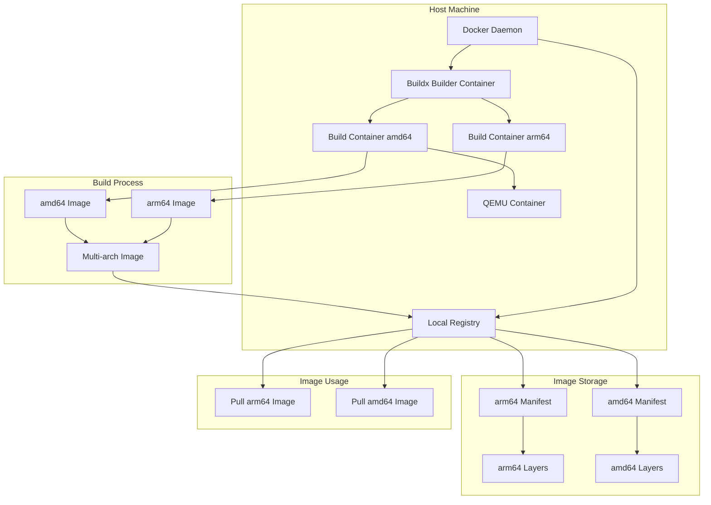
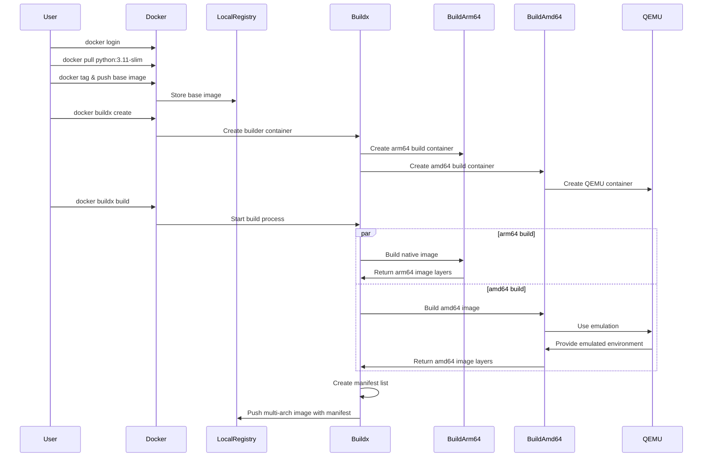

# Docker Buildx Multi-Architecture Example

This is a minimal project that demonstrates how to build multi-architecture Docker images using Docker Buildx. The project includes a simple Python application and a Dockerfile configured for multi-arch builds.

## Project Structure

```
.
├── Dockerfile          # Multi-arch Dockerfile
├── app.py             # Simple Python application
└── README.md          # This file
```

## Architecture Overview



## Build Process Flow



## Prerequisites

- Docker Desktop with Buildx support
- Docker Hub account (for pushing images)
- Local Docker registry (for testing)

## Setup Local Registry

If you want to test locally without pushing to a public registry, you can set up a local registry:

```bash
# Start a local registry (using port 5002 as an example)
docker run -d -p 5002:5000 --name registry registry:2
```

## Building Multi-Architecture Images

### 1. Setup Buildx Builder

First, create a Buildx builder that uses the Docker daemon directly:

```bash
# Create a new builder that uses the Docker daemon directly
docker buildx create --use --name mybuilder --driver docker-container --driver-opt network=host
```

### 2. Build and Push to Local Registry

First, we need to prepare the base image in the local registry:

```bash
# Pull the Python slim image
docker pull python:3.11-slim

# Tag and push it to the local registry
docker tag python:3.11-slim localhost:5002/python:3.11-slim
docker push localhost:5002/python:3.11-slim
```

Now, build and push the multi-architecture image to your local registry:

```bash
# Build and push to local registry (with attestations disabled)
docker buildx build --platform linux/amd64,linux/arm64 -t localhost:5002/multiarch-example:latest --push --provenance=false --sbom=false .
```

Note: The `--provenance=false --sbom=false` flags disable the generation of attestation manifests. If you don't specify these flags, you might see an additional "unknown/unknown" platform manifest in the image inspection output, which is used for build attestations and SBOM (Software Bill of Materials).

### 3. Verify the Build

After pushing to the local registry, you can verify the multi-architecture image:

1. Check the supported architectures:
```bash
docker buildx imagetools inspect localhost:5002/multiarch-example:latest
```

2. Test the image on different architectures:
```bash
# Run on your native architecture (e.g., arm64 on Apple Silicon)
docker run --rm localhost:5002/multiarch-example:latest

# Run on a specific architecture (requires QEMU)
docker run --rm --platform linux/amd64 localhost:5002/multiarch-example:latest
```

The application will display:
- Python version
- Architecture information
- Platform details

### 4. Manual Process to Push to Docker Hub

Due to potential network issues with Buildx accessing Docker Hub directly, we can use a manual process to push multi-arch images:

1. Pull the multi-arch image from local registry:
```bash
docker pull localhost:5002/multiarch-example:latest
```

2. Tag and push each architecture separately:
```bash
# For ARM64
docker pull --platform linux/arm64 localhost:5002/multiarch-example:latest
docker tag localhost:5002/multiarch-example:latest weli/multiarch-example:arm64
docker push weli/multiarch-example:arm64

# For AMD64
docker pull --platform linux/amd64 localhost:5002/multiarch-example:latest
docker tag localhost:5002/multiarch-example:latest weli/multiarch-example:amd64
docker push weli/multiarch-example:amd64
```

3. Verify the images on Docker Hub:
```bash
# Verify ARM64
docker pull --platform linux/arm64 weli/multiarch-example:arm64

# Verify AMD64
docker pull --platform linux/amd64 weli/multiarch-example:amd64
```

## Dockerfile Explanation

The Dockerfile is configured to support multi-architecture builds:

```dockerfile
# Use Python slim image as base
FROM --platform=$BUILDPLATFORM localhost:5002/python:3.11-slim

# Set working directory
WORKDIR /app

# Copy the application
COPY app.py .

# Make the script executable
RUN chmod +x app.py

# Set the entrypoint
ENTRYPOINT ["./app.py"]
```

Key points:
- `--platform=$BUILDPLATFORM` ensures the base image matches the target platform
- The application is copied and made executable
- The entrypoint is set to run the application

### Architecture Compatibility

| Host Architecture | Compatible Variants |
|------------------|---------------------|
| arm64            | arm64/v8, arm64     |
| amd64            | amd64, x86_64       |
| arm/v7           | arm/v7, arm32       |

## Troubleshooting

If you encounter network issues when pushing directly to Docker Hub with Buildx, use the manual process described above. This approach:
1. Builds the multi-arch image locally
2. Pushes to a local registry
3. Manually tags and pushes each architecture to Docker Hub
4. Verifies the images can be pulled for each architecture

## Cleanup

To remove the Buildx builder:
```bash
docker buildx rm mybuilder
```

To stop and remove the local registry:
```bash
docker stop registry
docker rm registry
```

## License

MIT

## Architecture Selection Process

When pulling and running a multi-architecture image, Docker automatically selects the appropriate architecture based on several factors:

### Automatic Architecture Selection

1. **Host Architecture Detection**
   ```mermaid
   sequenceDiagram
       participant User
       participant Docker
       participant Registry
       participant Host
       
       User->>Docker: docker pull multiarch-example:latest
       Docker->>Host: Detect system architecture
       Host-->>Docker: Return architecture (e.g., arm64)
       Docker->>Registry: Request manifest list
       Registry-->>Docker: Return manifest list
       Docker->>Docker: Match host architecture to manifest
       Docker->>Registry: Pull matching architecture image
       Registry-->>Docker: Return architecture-specific image
   ```

2. **Selection Process**
   - Docker first detects the host system's architecture
   - When pulling an image, it requests the manifest list
   - The manifest list contains all available architectures
   - Docker matches the host architecture with the available options
   - The matching architecture-specific image is pulled

3. **Fallback Behavior**
   - If exact architecture match isn't found, Docker looks for compatible variants
   - Example: `arm64` might use `arm64/v8` if available
   - If no compatible architecture is found, pull fails

### Manual Architecture Selection

You can override the automatic selection using the `--platform` flag:

```bash
# Force using amd64 architecture
docker run --platform linux/amd64 multiarch-example:latest

# Force using arm64 architecture
docker run --platform linux/arm64 multiarch-example:latest
```