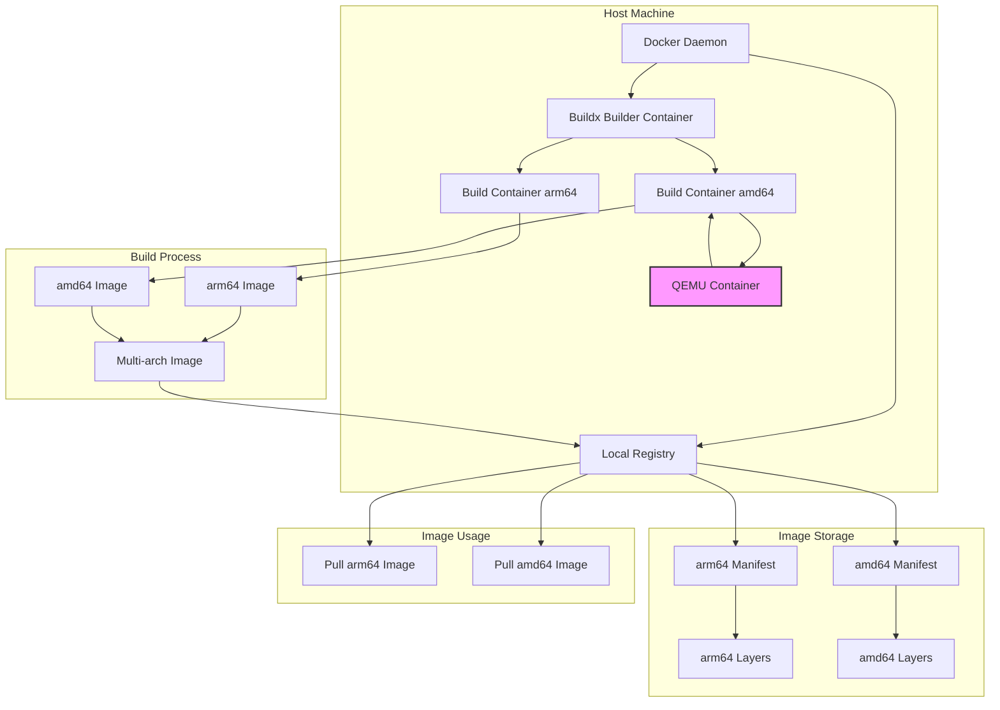
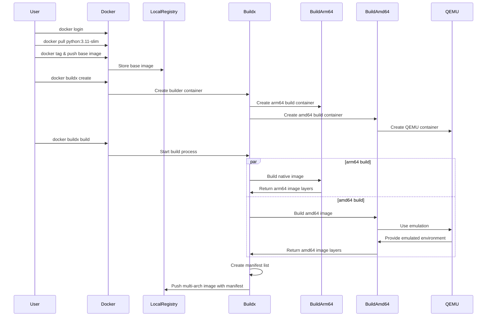

# Docker Buildx Multi-Architecture Example

This is a minimal project that demonstrates how to build multi-architecture Docker images using Docker Buildx. The project includes a simple Python application and a Dockerfile configured for multi-arch builds.

## Project Structure

```
.
├── Dockerfile          # Multi-arch Dockerfile
├── app.py             # Simple Python application
└── README.md          # This file
```

## Prerequisites

- Docker Desktop with Buildx support
- Docker Hub account (for pushing images)
- Local Docker registry (for testing)

## Architecture Overview



Note: The QEMU container (highlighted in pink) is only created when building for non-native architectures. For example, when building an amd64 image on an arm64 machine, the QEMU container provides the necessary emulation environment.

## Build Process Flow



## How QEMU Emulation Works

When building an AMD64 image on an ARM64 machine, the process works as follows:

1. **Binary Format Registration**:
   - The QEMU container registers binary formats in the host's `/proc/sys/fs/binfmt_misc/`
   - This tells the kernel how to handle AMD64 binaries on ARM64

2. **Build Process**:
   - The AMD64 build container provides a complete AMD64 environment
   - It manages the build context, layers, and Dockerfile instructions
   - When AMD64 binaries need to be executed:
     - The kernel intercepts the execution
     - Forwards it to QEMU in the QEMU container
     - QEMU emulates the AMD64 environment and executes the binaries
     - Results are returned to the build container

3. **Why Two Containers?**
   - **AMD64 Build Container**:
     - Provides a complete AMD64 environment
     - Manages build context and layers
     - Handles Dockerfile instructions
     - Maintains correct file system structure
     - Manages build dependencies and tools
   
   - **QEMU Container**:
     - Provides CPU emulation
     - Handles binary execution
     - Manages system call translation
     - Does not manage build environment

4. **Example Flow**:
   ```mermaid
   sequenceDiagram
       participant Build as AMD64 Build Container
       participant Kernel as Host Kernel
       participant QEMU as QEMU Container
       
       Build->>Kernel: Execute AMD64 binary
       Note over Build,Kernel: Build container manages environment
       Kernel->>QEMU: Forward execution
       QEMU->>QEMU: Emulate AMD64 environment
       QEMU->>Kernel: Return results
       Kernel->>Build: Return execution results
       Note over Build,Kernel: Build container continues build process
   ```

This separation of concerns allows:
- The build container to focus on managing the build environment and process
- The QEMU container to focus on CPU emulation
- Better isolation and reliability of the build process
- Proper handling of architecture-specific build requirements

## Dockerfile Explanation

The Dockerfile is configured to support multi-architecture builds:

```dockerfile
# Stage 1: Build for AMD64
FROM --platform=linux/amd64 localhost:5002/python:3.11-slim AS amd64_builder
WORKDIR /build
RUN echo "Building for AMD64" > arch.txt
RUN echo "AMD64 specific build steps" > build.log
RUN echo "Hello from AMD64!" > message.txt

# Stage 2: Build for ARM64
FROM --platform=linux/arm64 localhost:5002/python:3.11-slim AS arm64_builder
WORKDIR /build
RUN echo "Building for ARM64" > arch.txt
RUN echo "ARM64 specific build steps" > build.log
RUN echo "Hello from ARM64!" > message.txt

# Final stage: Combine results
FROM --platform=$BUILDPLATFORM localhost:5002/python:3.11-slim
WORKDIR /app

# Copy build artifacts from both architectures
COPY --from=amd64_builder /build/arch.txt /app/amd64_arch.txt
COPY --from=amd64_builder /build/message.txt /app/amd64_message.txt
COPY --from=arm64_builder /build/arch.txt /app/arm64_arch.txt
COPY --from=arm64_builder /build/message.txt /app/arm64_message.txt

# Copy and make the app executable
COPY app.py .
RUN chmod +x app.py

# Set the entrypoint
ENTRYPOINT ["./app.py"]
```

### Key Features of the Multi-Stage Build:

1. **Platform-Specific Build Stages**:
   - `amd64_builder`: Runs on AMD64 platform
   - `arm64_builder`: Runs on ARM64 platform
   - Each stage can have its own build process and dependencies

2. **Architecture Detection and Artifacts**:
   - The final image includes build artifacts from both architectures
   - The Python application displays the current architecture and platform information
   - Shows build artifacts from both AMD64 and ARM64 builds

3. **Example Output**:
   When running the container on different architectures, you'll see output like this:

   ```bash
   # On AMD64:
   Hello from Python 3.11.12!
   Running on x86_64 architecture
   Platform: Linux-xxx-x86_64-with-glibc2.36

   Build artifacts from both architectures:

   AMD64 build info:
   Building for AMD64
   Hello from AMD64!

   ARM64 build info:
   Building for ARM64
   Hello from ARM64!

   # On ARM64:
   Hello from Python 3.11.12!
   Running on aarch64 architecture
   Platform: Linux-xxx-aarch64-with-glibc2.36

   Build artifacts from both architectures:

   AMD64 build info:
   Building for AMD64
   Hello from AMD64!

   ARM64 build info:
   Building for ARM64
   Hello from ARM64!
   ```

## Architecture Compatibility

| Host Architecture | Compatible Variants |
|------------------|---------------------|
| arm64            | arm64/v8, arm64     |
| amd64            | amd64, x86_64       |
| arm/v7           | arm/v7, arm32       |

## Architecture Selection Process

When pulling and running a multi-architecture image, Docker automatically selects the appropriate architecture based on several factors:

### Automatic Architecture Selection

1. **Host Architecture Detection**
   ```mermaid
   sequenceDiagram
       participant User
       participant Docker
       participant Registry
       participant Host
       
       User->>Docker: docker pull multiarch-example:latest
       Docker->>Host: Detect system architecture
       Host-->>Docker: Return architecture (e.g., arm64)
       Docker->>Registry: Request manifest list
       Registry-->>Docker: Return manifest list
       Docker->>Docker: Match host architecture to manifest
       Docker->>Registry: Pull matching architecture image
       Registry-->>Docker: Return architecture-specific image
   ```

2. **Selection Process**
   - Docker first detects the host system's architecture
   - When pulling an image, it requests the manifest list
   - The manifest list contains all available architectures
   - Docker matches the host architecture with the available options
   - The matching architecture-specific image is pulled

3. **Fallback Behavior**
   - If exact architecture match isn't found, Docker looks for compatible variants
   - Example: `arm64` might use `arm64/v8` if available
   - If no compatible architecture is found, pull fails

### Manual Architecture Selection

You can override the automatic selection using the `--platform` flag:

```bash
# Force using amd64 architecture
docker run --platform linux/amd64 multiarch-example:latest

# Force using arm64 architecture
docker run --platform linux/arm64 multiarch-example:latest
```

## Step-by-Step Guide

### Step 1: Setup Local Registry

Start a local registry for testing:

```bash
# Start a local registry (using port 5002 as an example)
docker run -d -p 5002:5000 --name registry registry:2
```

### Step 2: Setup Buildx Builder

Create a Buildx builder that uses the Docker daemon directly:

```bash
# Create a new builder that uses the Docker daemon directly
docker buildx create --use --name mybuilder --driver docker-container --driver-opt network=host
```

### Step 3: Prepare Base Images

Before building the multi-arch image, prepare the base images in the local registry:

```bash
# Pull the Python slim image for both architectures
docker pull --platform linux/amd64 python:3.11-slim
docker pull --platform linux/arm64 python:3.11-slim

# Tag and push to local registry
docker tag python:3.11-slim localhost:5002/python:3.11-slim
docker push localhost:5002/python:3.11-slim
```

### Step 4: Build and Push to Local Registry

Build and push the multi-architecture image to your local registry:

```bash
# Build and push to local registry (with attestations disabled)
docker buildx build --platform linux/amd64,linux/arm64 -t localhost:5002/multiarch-example:latest --push --provenance=false --sbom=false .
```

Note: The `--provenance=false --sbom=false` flags disable the generation of attestation manifests. If you don't specify these flags, you might see an additional "unknown/unknown" platform manifest in the image inspection output, which is used for build attestations and SBOM (Software Bill of Materials).

### Step 5: Verify the Build

After pushing to the local registry, verify the multi-architecture image:

1. Check the supported architectures:
```bash
docker buildx imagetools inspect localhost:5002/multiarch-example:latest
```

2. Test the image on different architectures:
```bash
# Run on your native architecture (e.g., arm64 on Apple Silicon)
docker run --rm localhost:5002/multiarch-example:latest

# Run on a specific architecture (requires QEMU)
docker run --rm --platform linux/amd64 localhost:5002/multiarch-example:latest
```

The application will display:
- Python version
- Architecture information
- Platform details

### Step 6: Manual Process to Push to Docker Hub

Due to potential network issues with Buildx accessing Docker Hub directly, use this manual process:

1. Pull the multi-arch image from local registry:
```bash
docker pull localhost:5002/multiarch-example:latest
```

2. Tag and push each architecture separately:
```bash
# For ARM64
docker pull --platform linux/arm64 localhost:5002/multiarch-example:latest
docker tag localhost:5002/multiarch-example:latest weli/multiarch-example:arm64
docker push weli/multiarch-example:arm64

# For AMD64
docker pull --platform linux/amd64 localhost:5002/multiarch-example:latest
docker tag localhost:5002/multiarch-example:latest weli/multiarch-example:amd64
docker push weli/multiarch-example:amd64
```

3. Verify the images on Docker Hub:
```bash
# Verify ARM64
docker pull --platform linux/arm64 weli/multiarch-example:arm64

# Verify AMD64
docker pull --platform linux/amd64 weli/multiarch-example:amd64
```

### Step 7: Cleanup

When you're done, clean up the resources:

```bash
# Remove the Buildx builder
docker buildx rm mybuilder

# Stop and remove the local registry
docker stop registry
docker rm registry
```

## Troubleshooting

### Build Cache Issues

If you encounter issues with stale artifacts or unexpected files in your image, it might be due to the build cache. Here's how to resolve such issues:

1. Clean the buildx cache:
   ```bash
   # Remove all buildx cache
   docker buildx prune -f
   ```

2. Rebuild without using cache:
   ```bash
   # Build with --no-cache flag
   docker buildx build --no-cache --platform linux/amd64,linux/arm64 -t localhost:5002/multiarch-example:latest --push .
   ```

3. Clean up local images and pull fresh:
   ```bash
   # Remove local image
   docker rmi -f localhost:5002/multiarch-example:latest
   
   # Pull fresh image
   docker pull localhost:5002/multiarch-example:latest
   ```

### Network Issues

If you encounter network issues when pushing directly to Docker Hub with Buildx, use this manual process:
1. Build the multi-arch image locally
2. Push to a local registry
3. Manually tag and push each architecture to Docker Hub
4. Verify the images can be pulled for each architecture

### Platform Mismatch Warnings

You might see warnings like:
```
WARN: InvalidBaseImagePlatform: Base image was pulled with platform "linux/arm64", expected "linux/amd64"
```
This warning is expected when building multi-architecture images and can be safely ignored if:
1. You're using a local registry
2. The final image works correctly on all target platforms
3. The build completes successfully

## Best Practices

1. **Clean Builds**:
   - Use `--no-cache` when troubleshooting build issues
   - Regularly clean buildx cache with `docker buildx prune`
   - Remove local images before testing fresh builds

2. **Image Verification**:
   - Always test images on all target architectures
   - Verify the contents and behavior of the final image
   - Check for any unexpected files or artifacts

3. **Local Registry Usage**:
   - Use a local registry for faster development and testing
   - Tag and push base images to local registry first
   - Test images locally before pushing to Docker Hub

## License

MIT