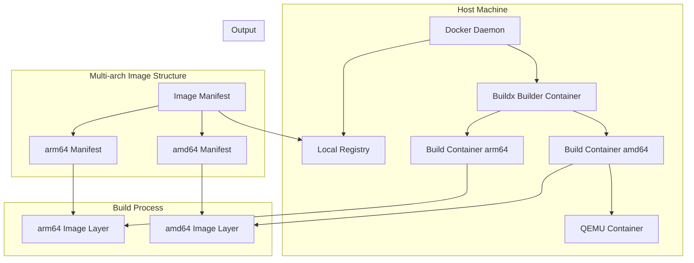
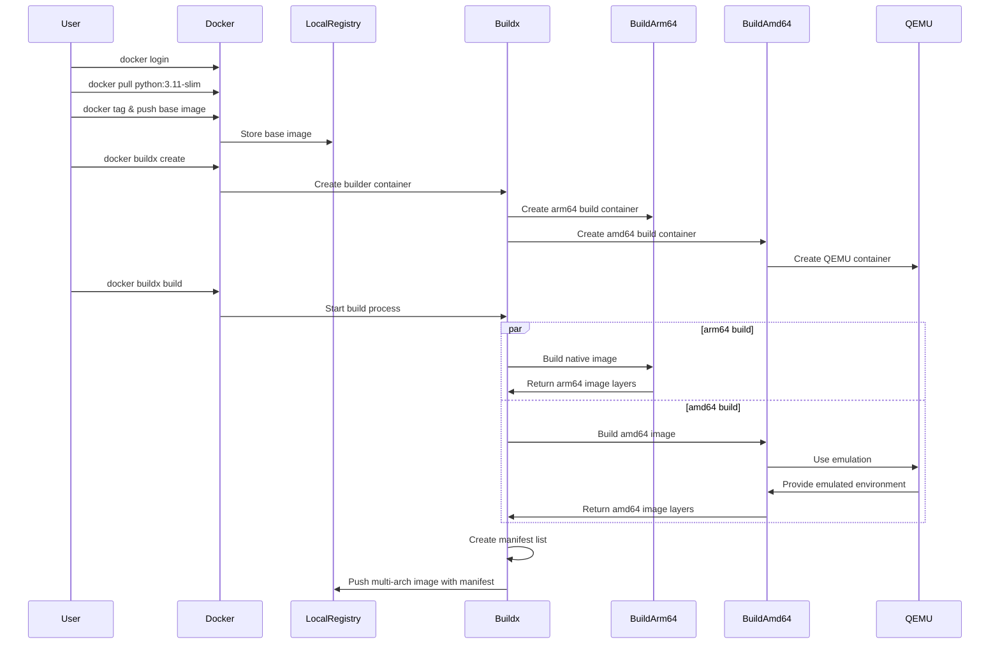

# Multi-Architecture Docker Build Example

This is a simple example demonstrating how to build Docker images for multiple architectures using Docker Buildx.

## Architecture Overview



## Build Process Flow



## Multi-Architecture Image Structure

A multi-architecture Docker image is a single image that contains multiple architecture-specific images within it. Here's how it's structured:

### Image Manifest List
- A single manifest list (index) that points to multiple architecture-specific manifests
- Each architecture-specific manifest points to its own set of layers
- The manifest list contains metadata about which architecture each image supports

### Example Structure
```
Multi-arch Image (single tag)
├── Manifest List
│   ├── linux/amd64 Manifest
│   │   └── amd64 Image Layers
│   └── linux/arm64 Manifest
│       └── arm64 Image Layers
```

### Key Points
1. **Single Tag**: All architectures are accessible through the same image tag
2. **Automatic Selection**: Docker automatically selects the correct architecture when pulling/running
3. **Efficient Storage**: Common layers are shared between architectures
4. **Manifest List**: The top-level manifest contains references to all architecture-specific images

### Verification
You can inspect the structure of a multi-arch image using:
```bash
docker buildx imagetools inspect localhost:5002/multiarch-example:latest
```

This will show:
- The manifest list digest
- Individual manifests for each architecture
- Platform information for each architecture
- Layer information for each architecture

## Buildx Architecture Explained

Docker Buildx uses a multi-container architecture to handle multi-architecture builds. Here's a detailed breakdown:

### Components

1. **Buildx Builder Container**
   - The main container that orchestrates the build process
   - Manages the creation and coordination of other containers
   - Handles the final assembly of the multi-architecture image

2. **Build Containers**
   - Separate containers created for each target architecture
   - Each build container is specialized for its target architecture
   - Run in parallel to maximize build efficiency
   - Example: When building for `linux/amd64` and `linux/arm64`, two separate build containers are created

3. **QEMU Containers**
   - Created only for non-native architectures
   - Provide emulation capabilities for cross-architecture builds
   - Example: When building `amd64` on an `arm64` machine, a QEMU container is created to handle the emulation

### Build Process

1. **Initialization**
   - The Buildx builder container is created
   - Build containers are spawned for each target architecture
   - QEMU containers are created as needed for emulation

2. **Parallel Building**
   - Each build container works independently
   - Native architecture builds run directly
   - Non-native architecture builds use QEMU emulation
   - Builds proceed in parallel for efficiency

3. **Image Assembly**
   - Individual architecture-specific images are combined
   - A manifest list is created to support multiple architectures
   - The final multi-architecture image is pushed to the registry

### Benefits of This Architecture

- **Parallelization**: Multiple architectures can be built simultaneously
- **Isolation**: Each build runs in its own container, preventing conflicts
- **Efficiency**: Native builds don't require emulation
- **Flexibility**: Easy to add support for new architectures
- **Reliability**: Issues in one build don't affect others

## Prerequisites

- Docker Desktop installed (with Buildx support)
- Docker Hub account (or other container registry)
- Local Docker registry (optional, for testing)

## Setup Local Registry (Optional)

If you want to test locally without pushing to a public registry, you can set up a local registry:

```bash
# Start a local registry (using port 5002 as an example)
docker run -d -p 5002:5000 --name registry registry:2
```

## Building the Multi-Architecture Image

1. Login to Docker Hub (if using public registry):
   ```bash
   docker login
   ```

2. Pull the base image (to avoid network issues during build):
   ```bash
   docker pull python:3.11-slim
   ```

3. If using local registry, tag and push the base image:
   ```bash
   docker tag python:3.11-slim localhost:5002/python:3.11-slim
   docker push localhost:5002/python:3.11-slim
   ```

4. Create and configure a Buildx builder:
   ```bash
   docker buildx create --use --name mybuilder --driver-opt network=host
   ```

5. Build and push the multi-architecture image:
   ```bash
   # For local registry
   docker buildx build \
     --platform linux/amd64,linux/arm64 \
     -t localhost:5002/multiarch-example:latest \
     --push .

   # For Docker Hub
   docker buildx build \
     --platform linux/amd64,linux/arm64 \
     -t yourusername/multiarch-example:latest \
     --push .
   ```

## Verifying the Build

Check the supported architectures:
```bash
docker buildx imagetools inspect localhost:5002/multiarch-example:latest
```

## Testing the Image

You can test the image on different architectures:

1. Run on your native architecture (e.g., arm64 on Apple Silicon):
   ```bash
   docker run --rm localhost:5002/multiarch-example:latest
   ```

2. Run on a specific architecture (requires QEMU):
   ```bash
   docker run --rm --platform linux/amd64 localhost:5002/multiarch-example:latest
   ```

The application will display:
- Python version
- Architecture information
- Platform details

## Troubleshooting

If you encounter network issues during the build:
1. Pull the base image manually first
2. Use a local registry for testing
3. Configure Buildx with host network access
4. Tag and push the base image to your local registry

## Cleanup

To remove the Buildx builder:
```bash
docker buildx rm mybuilder
```

To stop and remove the local registry:
```bash
docker stop registry
docker rm registry
```

## Notes

- The application will display the Python version and the architecture it's running on
- The Dockerfile uses `--platform=$BUILDPLATFORM` to ensure proper multi-architecture support
- The image is based on Python 3.11 slim for a smaller footprint
- Using a local registry is helpful for testing without pushing to public registries 

## Architecture Selection Process

When pulling and running a multi-architecture image, Docker automatically selects the appropriate architecture based on several factors:

### Automatic Architecture Selection

1. **Host Architecture Detection**
   ```mermaid
   sequenceDiagram
       participant User
       participant Docker
       participant Registry
       participant Host
       
       User->>Docker: docker pull multiarch-example:latest
       Docker->>Host: Detect system architecture
       Host-->>Docker: Return architecture (e.g., arm64)
       Docker->>Registry: Request manifest list
       Registry-->>Docker: Return manifest list
       Docker->>Docker: Match host architecture to manifest
       Docker->>Registry: Pull matching architecture image
       Registry-->>Docker: Return architecture-specific image
   ```

2. **Selection Process**
   - Docker first detects the host system's architecture
   - When pulling an image, it requests the manifest list
   - The manifest list contains all available architectures
   - Docker matches the host architecture with the available options
   - The matching architecture-specific image is pulled

3. **Fallback Behavior**
   - If exact architecture match isn't found, Docker looks for compatible variants
   - Example: `arm64` might use `arm64/v8` if available
   - If no compatible architecture is found, pull fails

### Manual Architecture Selection

You can override the automatic selection using the `--platform` flag:

```bash
# Force using amd64 architecture
docker run --platform linux/amd64 multiarch-example:latest

# Force using arm64 architecture
docker run --platform linux/arm64 multiarch-example:latest
```

### Architecture Compatibility

| Host Architecture | Compatible Variants |
|------------------|---------------------|
| arm64            | arm64/v8, arm64     |
| amd64            | amd64, x86_64       |
| arm/v7           | arm/v7, arm32       |

### Verification

You can check which architecture is being used:

```bash
# Check image architecture
docker inspect --format='{{.Architecture}}' multiarch-example:latest

# Run and check architecture
docker run --rm multiarch-example:latest
```

The output will show the actual architecture being used. 