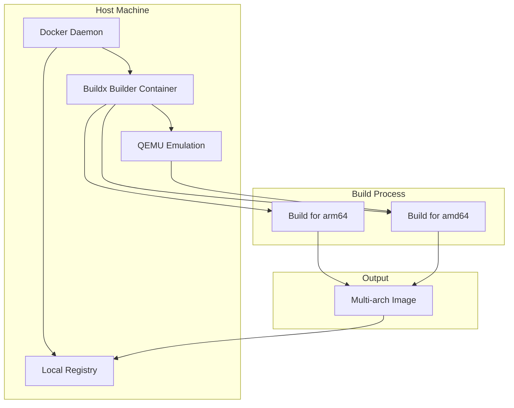
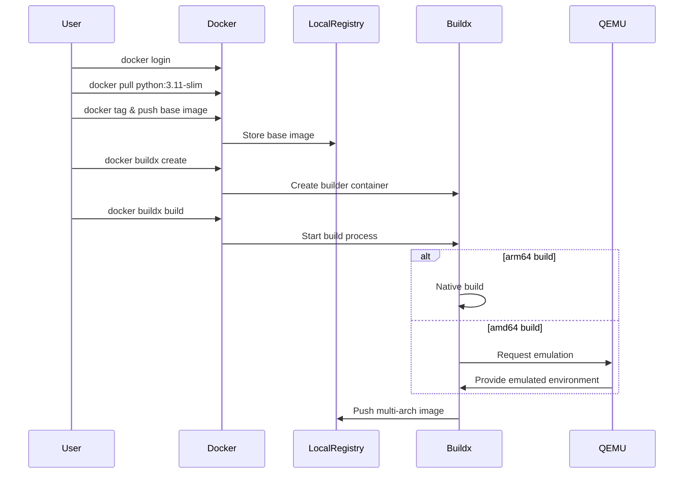

# Multi-Architecture Docker Build Example

This is a simple example demonstrating how to build Docker images for multiple architectures using Docker Buildx.

## Architecture Overview



## Build Process Flow



## Prerequisites

- Docker Desktop installed (with Buildx support)
- Docker Hub account (or other container registry)
- Local Docker registry (optional, for testing)

## Setup Local Registry (Optional)

If you want to test locally without pushing to a public registry, you can set up a local registry:

```bash
# Start a local registry (using port 5002 as an example)
docker run -d -p 5002:5000 --name registry registry:2
```

## Building the Multi-Architecture Image

1. Login to Docker Hub (if using public registry):
   ```bash
   docker login
   ```

2. Pull the base image (to avoid network issues during build):
   ```bash
   docker pull python:3.11-slim
   ```

3. If using local registry, tag and push the base image:
   ```bash
   docker tag python:3.11-slim localhost:5002/python:3.11-slim
   docker push localhost:5002/python:3.11-slim
   ```

4. Create and configure a Buildx builder:
   ```bash
   docker buildx create --use --name mybuilder --driver-opt network=host
   ```

5. Build and push the multi-architecture image:
   ```bash
   # For local registry
   docker buildx build \
     --platform linux/amd64,linux/arm64 \
     -t localhost:5002/multiarch-example:latest \
     --push .

   # For Docker Hub
   docker buildx build \
     --platform linux/amd64,linux/arm64 \
     -t yourusername/multiarch-example:latest \
     --push .
   ```

## Verifying the Build

Check the supported architectures:
```bash
docker buildx imagetools inspect localhost:5002/multiarch-example:latest
```

## Testing the Image

You can test the image on different architectures:

1. Run on your native architecture (e.g., arm64 on Apple Silicon):
   ```bash
   docker run --rm localhost:5002/multiarch-example:latest
   ```

2. Run on a specific architecture (requires QEMU):
   ```bash
   docker run --rm --platform linux/amd64 localhost:5002/multiarch-example:latest
   ```

The application will display:
- Python version
- Architecture information
- Platform details

## Troubleshooting

If you encounter network issues during the build:
1. Pull the base image manually first
2. Use a local registry for testing
3. Configure Buildx with host network access
4. Tag and push the base image to your local registry

## Cleanup

To remove the Buildx builder:
```bash
docker buildx rm mybuilder
```

To stop and remove the local registry:
```bash
docker stop registry
docker rm registry
```

## Notes

- The application will display the Python version and the architecture it's running on
- The Dockerfile uses `--platform=$BUILDPLATFORM` to ensure proper multi-architecture support
- The image is based on Python 3.11 slim for a smaller footprint
- Using a local registry is helpful for testing without pushing to public registries 