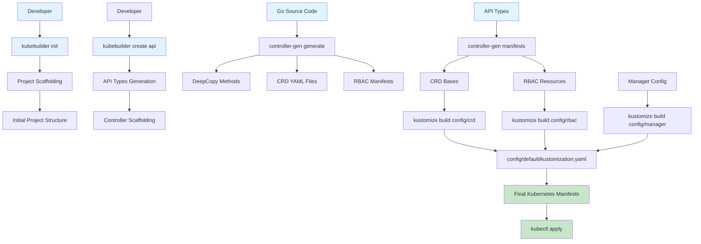
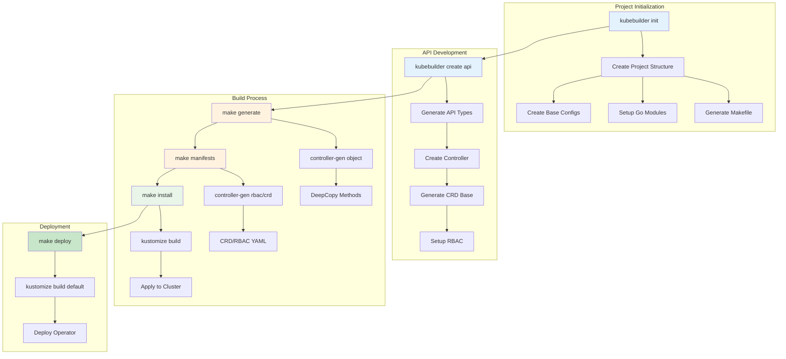
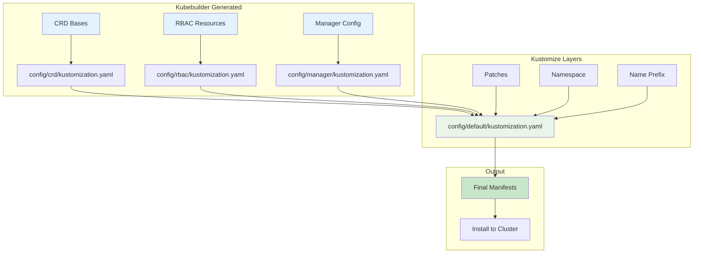
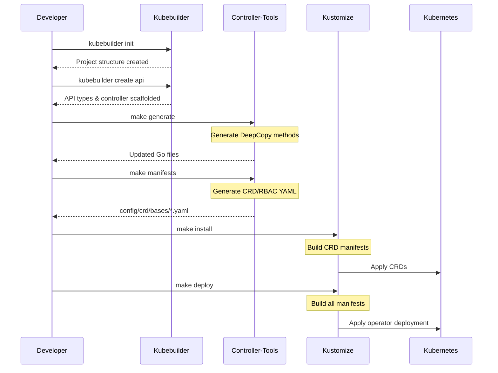
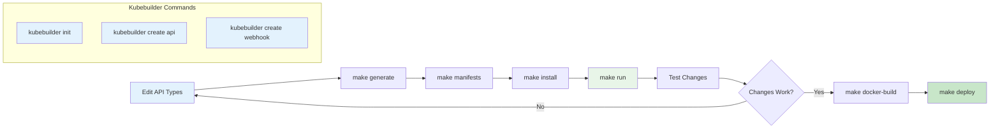

# Application Operator

A Kubernetes operator that manages application deployments with a simplified interface. This operator provides a custom resource `Application` that makes it easier to deploy and manage applications in Kubernetes.

## Features

- Simplified application deployment using a single custom resource
- Automatic creation of Deployments and Services
- Resource management (CPU and Memory limits/requests)
- Environment variable configuration
- Status monitoring and reporting
- Automatic reconciliation of desired state

## Prerequisites

- Kubernetes cluster
- kubectl configured to communicate with your cluster
- Go 1.19 or later
- Make
- k8s CLI tool (for k8s kubectl integration)
- Kubebuilder (for development)

### Installing Kubebuilder

1. Download the latest Kubebuilder release:
```bash
# For macOS
brew install kubebuilder

# For Linux
# Download the latest release
curl -L -o kubebuilder https://go.kubebuilder.io/dl/latest/$(go env GOOS)/$(go env GOARCH)
# Make it executable
chmod +x kubebuilder
# Move it to a directory in your PATH
sudo mv kubebuilder /usr/local/bin/
```

2. Verify the installation:
```bash
kubebuilder version
```

3. Install the required tools:
```bash
# Install controller-gen
go install sigs.k8s.io/controller-tools/cmd/controller-gen@latest

# Install kustomize
go install sigs.k8s.io/kustomize/kustomize/v5@latest
```

## Kubebuilder Build Process and Tool Integration

Kubebuilder uses several key tools in its build process to generate and manage Kubernetes resources. Understanding how these tools work together is crucial for operator development.

### Controller-Tools Integration

Controller-tools is a collection of utilities for generating Kubernetes API code, including:

1. **Code Generation**: Generates DeepCopy, DeepCopyInto, and DeepCopyObject methods
2. **CRD Generation**: Creates CustomResourceDefinition YAML files from Go structs
3. **RBAC Generation**: Generates RBAC manifests (ClusterRole, Role, RoleBinding)
4. **Webhook Generation**: Creates admission webhook configurations

#### Controller-Tools Usage in Makefile

```makefile
# Generate CRD and RBAC manifests
manifests: controller-gen
	$(CONTROLLER_GEN) rbac:roleName=manager-role crd webhook paths="./..." output:crd:artifacts:config=config/crd/bases

# Generate DeepCopy methods
generate: controller-gen
	$(CONTROLLER_GEN) object:headerFile="hack/boilerplate.go.txt" paths="./..."
```

#### Controller-Tools Markers

Controller-tools uses special comment markers in Go code to generate Kubernetes resources:

```go
//+kubebuilder:object:root=true
//+kubebuilder:subresource:status
//+kubebuilder:printcolumn:name="Image",type="string",JSONPath=".spec.image"
type Application struct {
    metav1.TypeMeta   `json:",inline"`
    metav1.ObjectMeta `json:"metadata,omitempty"`
    Spec   ApplicationSpec   `json:"spec,omitempty"`
    Status ApplicationStatus `json:"status,omitempty"`
}
```

### Kustomize Integration

Kustomize is used for managing Kubernetes manifests through a declarative approach, allowing customization without modifying original files.

#### Kustomize Directory Structure

```
config/
├── crd/                    # Custom Resource Definitions
│   ├── bases/             # Base CRD files (generated by controller-gen)
│   ├── kustomization.yaml # Kustomize config for CRDs
│   └── kustomizeconfig.yaml
├── rbac/                  # RBAC resources
│   ├── role.yaml
│   ├── role_binding.yaml
│   └── kustomization.yaml
├── manager/               # Manager deployment
│   ├── manager.yaml
│   └── kustomization.yaml
└── default/               # Default deployment configuration
    ├── kustomization.yaml # Main kustomization file
    └── manager_auth_proxy_patch.yaml
```

#### Kustomize Usage in Makefile

```makefile
# Install CRDs using kustomize
install: manifests kustomize
	$(KUSTOMIZE) build config/crd | $(KUBECTL) apply -f -

# Deploy controller using kustomize
deploy: manifests kustomize
	cd config/manager && $(KUSTOMIZE) edit set image controller=${IMG}
	$(KUSTOMIZE) build config/default | $(KUBECTL) apply -f -

# Build installer with all resources
build-installer: manifests generate kustomize
	mkdir -p dist
	$(KUSTOMIZE) build config/crd > dist/install.yaml
	echo "---" >> dist/install.yaml
	cd config/manager && $(KUSTOMIZE) edit set image controller=${IMG}
	$(KUSTOMIZE) build config/default >> dist/install.yaml
```

### Build Process Flow



### Kubebuilder Project Lifecycle



### Kustomize Configuration Layers



### Code Generation Process



### Development Workflow



### Tool Dependencies and Versions

The Makefile manages tool versions and installations:

```makefile
## Tool Versions
KUSTOMIZE_VERSION ?= v5.3.0
CONTROLLER_TOOLS_VERSION ?= v0.14.0
ENVTEST_VERSION ?= latest
GOLANGCI_LINT_VERSION ?= v1.54.2

## Tool Binaries
KUSTOMIZE ?= $(LOCALBIN)/kustomize-$(KUSTOMIZE_VERSION)
CONTROLLER_GEN ?= $(LOCALBIN)/controller-gen-$(CONTROLLER_TOOLS_VERSION)
```

## Development Setup

1. Create a new operator project:
```bash
# Create a new directory for your project
mkdir operator-example
cd operator-example

# Initialize a new operator project
kubebuilder init --domain example.com --repo github.com/example/operator-example

# Create a new API
kubebuilder create api --group apps --version v1alpha1 --kind Application
```

2. The project structure will be created with:
   - API definitions in `api/v1alpha1/`
   - Controller implementation in `internal/controller/`
   - CRD manifests in `config/crd/`
   - Sample resources in `config/samples/`

3. Build the project:
```bash
# Generate code and manifests
make generate

# Build the operator
make build
```

## Installation

1. Install the CRD:
```bash
# This will generate and install the Custom Resource Definition
sudo -E make install
```

2. Run the operator:
```bash
# This will build and run the operator locally
sudo -E make run
```

The operator will start and begin watching for Application resources. You should see logs indicating that the controller has started successfully.

## Usage

### Creating an Application

Create an Application resource using the following YAML:

```yaml
apiVersion: apps.example.com/v1alpha1
kind: Application
metadata:
  name: sample-app
spec:
  image: nginx:latest
  replicas: 3
  port: 80
  resources:
    cpuRequest: "100m"
    memoryRequest: "128Mi"
    cpuLimit: "200m"
    memoryLimit: "256Mi"
  env:
    - name: ENVIRONMENT
      value: production
    - name: LOG_LEVEL
      value: info
```

Apply the configuration:
```bash
kubectl apply -f config/samples/apps_v1alpha1_application.yaml
```

### Application Resource Fields

- `image`: Container image to run
- `replicas`: Number of desired pods (default: 1)
- `port`: Port that the application listens on (default: 80)
- `resources`: Compute resource requirements
  - `cpuRequest`: CPU request (e.g., "100m", "0.1", "1")
  - `memoryRequest`: Memory request (e.g., "64Mi", "1Gi")
  - `cpuLimit`: CPU limit
  - `memoryLimit`: Memory limit
- `env`: List of environment variables
  - `name`: Environment variable name
  - `value`: Environment variable value

### Monitoring

The operator automatically updates the Application status with:
- Available replicas
- Ready replicas
- Updated replicas
- Conditions

View the status:
```bash
kubectl describe application <application-name>
```

### Generated Resources

The operator automatically creates and manages:
1. Deployment
   - Manages the application pods
   - Handles scaling and updates
2. Service
   - Type: ClusterIP
   - Exposes the application port

View the generated resources:
```bash
kubectl get deployments
kubectl get services
kubectl get pods
```

## Development

### Project Structure

```
operator-example/
├── api/                    # API definitions
│   └── v1alpha1/          # v1alpha1 API version
├── config/                # Configuration files
│   ├── crd/              # CRD definitions
│   └── samples/          # Sample resources
├── internal/             # Internal packages
│   └── controller/       # Controller implementation
└── cmd/                  # Command line entry point
```

### Building and Running

1. Generate CRD and RBAC manifests:
```bash
# Generate CRD and RBAC manifests
sudo -E make generate
```

2. Install the CRD:
```bash
# Install the CRD into the cluster
sudo -E make install
```

3. Run the operator:
```bash
# Build and run the operator locally
sudo -E make run
```

The operator will:
- Connect to your Kubernetes cluster using k8s kubectl configuration
- Start watching for Application resources
- Create and manage Deployments and Services
- Update Application status

### Testing

1. Create a sample Application:
```bash
# Apply the sample Application resource
sudo -E k8s kubectl apply -f config/samples/apps_v1alpha1_application.yaml
```

2. Verify the resources:
```bash
# Check the Application status
sudo -E k8s kubectl describe application sample-app

# Check the generated Deployment
sudo -E k8s kubectl get deployments

# Check the generated Service
sudo -E k8s kubectl get services

# Check the running pods
sudo -E k8s kubectl get pods
```

### Common Issues

1. If you see "no matches for kind 'Application'" error:
   - Make sure you've run `make install` to install the CRD
   - Verify the CRD is installed: `k8s kubectl get crd applications.apps.example.com`

2. If you see "unable to get kubeconfig" error:
   - Ensure k8s kubectl is properly configured
   - Check that you're running commands with `sudo -E` to preserve environment variables

3. If you see "object has been modified" error:
   - This is normal during status updates
   - The operator will automatically retry the operation

## License

This project is licensed under the Apache License 2.0 - see the LICENSE file for details.

---

基于对crd-example项目的分析，如果不使用kubebuilder创建的controller并且不使用webhook，会损失以下功能：

## 1. **自动代码生成功能**
- **DeepCopy方法**：需要手动实现DeepCopy、DeepCopyInto、DeepCopyObject方法
- **CRD YAML生成**：需要手动编写和维护CustomResourceDefinition YAML文件
- **RBAC资源生成**：需要手动创建ClusterRole、Role、RoleBinding等权限配置
- **Client代码生成**：需要手动生成typed client、informer、lister等代码

## 2. **项目脚手架和结构**
- **标准项目结构**：需要手动创建符合Kubernetes最佳实践的项目目录结构
- **Makefile工具链**：需要手动编写构建、测试、部署的Makefile规则
- **依赖管理**：需要手动配置Go modules和版本管理

## 3. **开发工具集成**
- **controller-gen集成**：失去与controller-tools的深度集成
- **kustomize集成**：失去与kustomize的自动化配置管理
- **测试框架**：失去envtest等测试工具的自动配置

## 4. **Webhook相关功能**
- **准入控制**：无法实现资源创建/更新时的验证逻辑
- **默认值设置**：无法自动设置字段默认值
- **字段验证**：失去基于webhook的复杂验证规则
- **转换webhook**：无法实现API版本间的自动转换

## 5. **监控和可观测性**
- **Metrics端点**：需要手动配置Prometheus metrics
- **健康检查**：需要手动实现健康检查端点
- **日志配置**：失去标准化的日志配置

## 6. **部署和运维**
- **多架构支持**：失去自动的多平台镜像构建支持
- **证书管理**：webhook相关的TLS证书需要手动管理
- **Leader选举**：需要手动实现controller的leader选举机制

## 7. **开发效率**
- **快速迭代**：失去热重载和快速开发体验
- **调试工具**：失去集成的调试和profiling工具
- **文档生成**：失去自动的API文档生成

## 8. **最佳实践**
- **安全配置**：失去默认的安全最佳实践配置
- **资源限制**：需要手动配置资源请求和限制
- **错误处理**：失去标准化的错误处理模式

## 总结

虽然不使用kubebuilder和webhook仍然可以创建自定义控制器，但会失去大量的自动化功能、开发效率和最佳实践支持。对于生产环境的operator开发，这些功能的缺失会显著增加开发复杂度和维护成本。

---

DeepCopy methods是Go语言中用于深度复制对象的方法，在Kubernetes API开发中非常重要。让我详细解释一下：

## 什么是DeepCopy

DeepCopy是指创建一个对象的完全独立副本，包括所有嵌套的对象和指针。与浅拷贝（shallow copy）不同，深拷贝会递归地复制所有引用的对象。

## 为什么需要DeepCopy

在Kubernetes中，API对象经常被多个组件共享和修改。为了避免意外的副作用，需要确保每个组件都有自己独立的对象副本。

### 示例对比

```go
// 浅拷贝 - 只复制指针
type Application struct {
    Spec   ApplicationSpec
    Status ApplicationStatus
}

// 浅拷贝后，两个对象共享同一个Spec
app1 := &Application{Spec: spec1}
app2 := app1  // 这只是指针复制，不是深拷贝

// 深拷贝 - 创建完全独立的副本
app2 := app1.DeepCopy()  // 创建完全独立的副本
```

## DeepCopy方法的类型

Kubernetes中通常需要实现三种DeepCopy方法：

### 1. DeepCopy()
```go
// DeepCopy returns a deep copy of the Application
func (in *Application) DeepCopy() *Application {
    if in == nil {
        return nil
    }
    out := new(Application)
    in.DeepCopyInto(out)
    return out
}
```

### 2. DeepCopyInto()
```go
// DeepCopyInto copies the receiver into the given Application
func (in *Application) DeepCopyInto(out *Application) {
    *out = *in
    out.TypeMeta = in.TypeMeta
    in.ObjectMeta.DeepCopyInto(&out.ObjectMeta)
    in.Spec.DeepCopyInto(&out.Spec)
    in.Status.DeepCopyInto(&out.Status)
}
```

### 3. DeepCopyObject()
```go
// DeepCopyObject is an autogenerated deepcopy function, copying the receiver
func (in *Application) DeepCopyObject() runtime.Object {
    if c := in.DeepCopy(); c != nil {
        return c
    }
    return nil
}
```

## 实际应用场景

### 1. **Controller中的状态更新**
```go
func (r *ApplicationReconciler) Reconcile(ctx context.Context, req ctrl.Request) error {
    var app v1alpha1.Application
    if err := r.Get(ctx, req.NamespacedName, &app); err != nil {
        return err
    }
    
    // 创建深拷贝以避免修改原始对象
    appCopy := app.DeepCopy()
    appCopy.Status.AvailableReplicas = 3
    
    // 更新状态
    return r.Status().Update(ctx, appCopy)
}
```

### 2. **Webhook中的验证**
```go
func (r *Application) ValidateUpdate(old runtime.Object) error {
    // 创建深拷贝进行验证，不影响原始对象
    oldCopy := old.(*Application).DeepCopy()
    newCopy := r.DeepCopy()
    
    // 进行验证逻辑
    return validateApplicationUpdate(oldCopy, newCopy)
}
```

### 3. **缓存和存储**
```go
// 在informer中存储对象时使用深拷贝
func (c *applicationController) OnAdd(obj interface{}) {
    app := obj.(*v1alpha1.Application).DeepCopy()
    c.cache[app.Name] = app
}
```

## 手动实现vs自动生成

### 手动实现（复杂且容易出错）
```go
func (in *Application) DeepCopyInto(out *Application) {
    *out = *in
    out.TypeMeta = in.TypeMeta
    
    // 手动复制每个字段
    if in.Spec.Resources != nil {
        out.Spec.Resources = &ResourceRequirements{
            CPURequest:    in.Spec.Resources.CPURequest,
            MemoryRequest: in.Spec.Resources.MemoryRequest,
            CPULimit:      in.Spec.Resources.CPULimit,
            MemoryLimit:   in.Spec.Resources.MemoryLimit,
        }
    }
    
    // 复制切片
    if in.Spec.Env != nil {
        out.Spec.Env = make([]EnvVar, len(in.Spec.Env))
        for i := range in.Spec.Env {
            out.Spec.Env[i] = EnvVar{
                Name:  in.Spec.Env[i].Name,
                Value: in.Spec.Env[i].Value,
            }
        }
    }
    
    // 复制状态
    if in.Status.Conditions != nil {
        out.Status.Conditions = make([]metav1.Condition, len(in.Status.Conditions))
        for i := range in.Status.Conditions {
            out.Status.Conditions[i] = metav1.Condition{
                Type:               in.Status.Conditions[i].Type,
                Status:             in.Status.Conditions[i].Status,
                ObservedGeneration: in.Status.Conditions[i].ObservedGeneration,
                LastTransitionTime: in.Status.Conditions[i].LastTransitionTime,
                Reason:             in.Status.Conditions[i].Reason,
                Message:            in.Status.Conditions[i].Message,
            }
        }
    }
}
```

### 自动生成（controller-gen）
```go
// 只需要在类型定义中添加标记
//+kubebuilder:object:root=true
type Application struct {
    metav1.TypeMeta   `json:",inline"`
    metav1.ObjectMeta `json:"metadata,omitempty"`
    Spec   ApplicationSpec   `json:"spec,omitempty"`
    Status ApplicationStatus `json:"status,omitempty"`
}

// controller-gen会自动生成所有DeepCopy方法
```

## 性能考虑

- **内存使用**：DeepCopy会消耗更多内存，因为要创建完整的对象副本
- **CPU开销**：对于大型对象，DeepCopy可能比较耗时
- **优化策略**：只在必要时使用DeepCopy，避免不必要的复制

## 总结

DeepCopy methods是Kubernetes API开发中的基础功能，确保对象的安全共享和修改。使用controller-gen自动生成这些方法可以：
- 减少手动编写代码的工作量
- 避免深拷贝逻辑的错误
- 确保与Kubernetes API规范的一致性
- 提高开发效率和代码质量