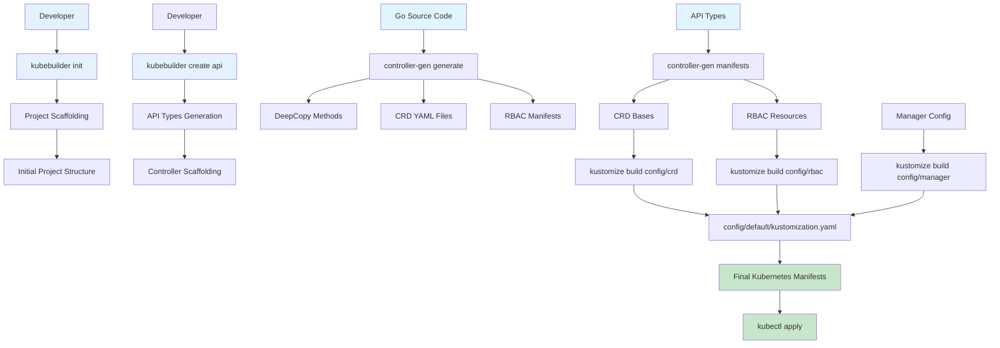
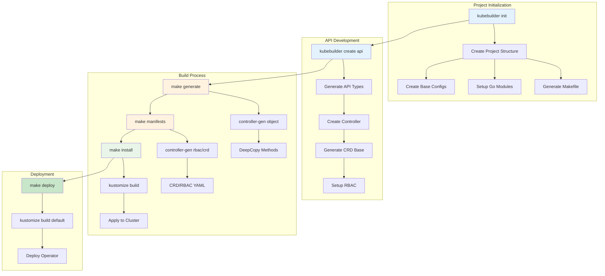
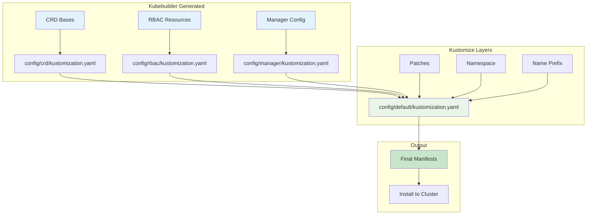
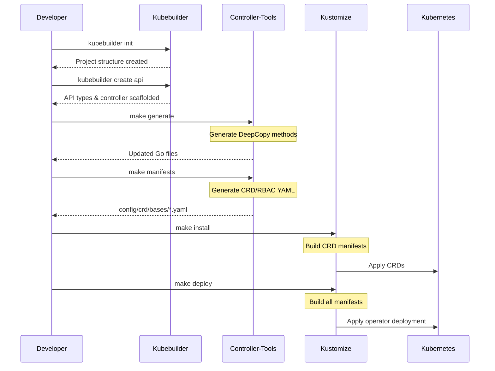
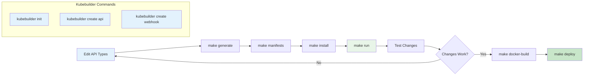

# Application Operator

A Kubernetes operator that manages application deployments with a simplified interface. This operator provides a custom resource `Application` that makes it easier to deploy and manage applications in Kubernetes.

## Features

- Simplified application deployment using a single custom resource
- Automatic creation of Deployments and Services
- Resource management (CPU and Memory limits/requests)
- Environment variable configuration
- Status monitoring and reporting
- Automatic reconciliation of desired state

## Prerequisites

- Kubernetes cluster
- kubectl configured to communicate with your cluster
- Go 1.19 or later
- Make
- k8s CLI tool (for k8s kubectl integration)
- Kubebuilder (for development)

### Installing Kubebuilder

1. Download the latest Kubebuilder release:
```bash
# For macOS
brew install kubebuilder

# For Linux
# Download the latest release
curl -L -o kubebuilder https://go.kubebuilder.io/dl/latest/$(go env GOOS)/$(go env GOARCH)
# Make it executable
chmod +x kubebuilder
# Move it to a directory in your PATH
sudo mv kubebuilder /usr/local/bin/
```

2. Verify the installation:
```bash
kubebuilder version
```

3. Install the required tools:
```bash
# Install controller-gen
go install sigs.k8s.io/controller-tools/cmd/controller-gen@latest

# Install kustomize
go install sigs.k8s.io/kustomize/kustomize/v5@latest
```

## Kubebuilder Build Process and Tool Integration

Kubebuilder uses several key tools in its build process to generate and manage Kubernetes resources. Understanding how these tools work together is crucial for operator development.

### Controller-Tools Integration

Controller-tools is a collection of utilities for generating Kubernetes API code, including:

1. **Code Generation**: Generates DeepCopy, DeepCopyInto, and DeepCopyObject methods
2. **CRD Generation**: Creates CustomResourceDefinition YAML files from Go structs
3. **RBAC Generation**: Generates RBAC manifests (ClusterRole, Role, RoleBinding)
4. **Webhook Generation**: Creates admission webhook configurations

#### Controller-Tools Usage in Makefile

```makefile
# Generate CRD and RBAC manifests
manifests: controller-gen
	$(CONTROLLER_GEN) rbac:roleName=manager-role crd webhook paths="./..." output:crd:artifacts:config=config/crd/bases

# Generate DeepCopy methods
generate: controller-gen
	$(CONTROLLER_GEN) object:headerFile="hack/boilerplate.go.txt" paths="./..."
```

#### Controller-Tools Markers

Controller-tools uses special comment markers in Go code to generate Kubernetes resources:

```go
//+kubebuilder:object:root=true
//+kubebuilder:subresource:status
//+kubebuilder:printcolumn:name="Image",type="string",JSONPath=".spec.image"
type Application struct {
    metav1.TypeMeta   `json:",inline"`
    metav1.ObjectMeta `json:"metadata,omitempty"`
    Spec   ApplicationSpec   `json:"spec,omitempty"`
    Status ApplicationStatus `json:"status,omitempty"`
}
```

### Kustomize Integration

Kustomize is used for managing Kubernetes manifests through a declarative approach, allowing customization without modifying original files.

#### Kustomize Directory Structure

```
config/
├── crd/                    # Custom Resource Definitions
│   ├── bases/             # Base CRD files (generated by controller-gen)
│   ├── kustomization.yaml # Kustomize config for CRDs
│   └── kustomizeconfig.yaml
├── rbac/                  # RBAC resources
│   ├── role.yaml
│   ├── role_binding.yaml
│   └── kustomization.yaml
├── manager/               # Manager deployment
│   ├── manager.yaml
│   └── kustomization.yaml
└── default/               # Default deployment configuration
    ├── kustomization.yaml # Main kustomization file
    └── manager_auth_proxy_patch.yaml
```

#### Kustomize Usage in Makefile

```makefile
# Install CRDs using kustomize
install: manifests kustomize
	$(KUSTOMIZE) build config/crd | $(KUBECTL) apply -f -

# Deploy controller using kustomize
deploy: manifests kustomize
	cd config/manager && $(KUSTOMIZE) edit set image controller=${IMG}
	$(KUSTOMIZE) build config/default | $(KUBECTL) apply -f -

# Build installer with all resources
build-installer: manifests generate kustomize
	mkdir -p dist
	$(KUSTOMIZE) build config/crd > dist/install.yaml
	echo "---" >> dist/install.yaml
	cd config/manager && $(KUSTOMIZE) edit set image controller=${IMG}
	$(KUSTOMIZE) build config/default >> dist/install.yaml
```

### Build Process Flow



### Kubebuilder Project Lifecycle



### Kustomize Configuration Layers



### Code Generation Process



### Development Workflow



### Tool Dependencies and Versions

The Makefile manages tool versions and installations:

```makefile
## Tool Versions
KUSTOMIZE_VERSION ?= v5.3.0
CONTROLLER_TOOLS_VERSION ?= v0.14.0
ENVTEST_VERSION ?= latest
GOLANGCI_LINT_VERSION ?= v1.54.2

## Tool Binaries
KUSTOMIZE ?= $(LOCALBIN)/kustomize-$(KUSTOMIZE_VERSION)
CONTROLLER_GEN ?= $(LOCALBIN)/controller-gen-$(CONTROLLER_TOOLS_VERSION)
```

## Development Setup

1. Create a new operator project:
```bash
# Create a new directory for your project
mkdir operator-example
cd operator-example

# Initialize a new operator project
kubebuilder init --domain example.com --repo github.com/example/operator-example

# Create a new API
kubebuilder create api --group apps --version v1alpha1 --kind Application
```

2. The project structure will be created with:
   - API definitions in `api/v1alpha1/`
   - Controller implementation in `internal/controller/`
   - CRD manifests in `config/crd/`
   - Sample resources in `config/samples/`

3. Build the project:
```bash
# Generate code and manifests
make generate

# Build the operator
make build
```

## Installation

1. Install the CRD:
```bash
# This will generate and install the Custom Resource Definition
sudo -E make install
```

2. Run the operator:
```bash
# This will build and run the operator locally
sudo -E make run
```

The operator will start and begin watching for Application resources. You should see logs indicating that the controller has started successfully.

## Usage

### Creating an Application

Create an Application resource using the following YAML:

```yaml
apiVersion: apps.example.com/v1alpha1
kind: Application
metadata:
  name: sample-app
spec:
  image: nginx:latest
  replicas: 3
  port: 80
  resources:
    cpuRequest: "100m"
    memoryRequest: "128Mi"
    cpuLimit: "200m"
    memoryLimit: "256Mi"
  env:
    - name: ENVIRONMENT
      value: production
    - name: LOG_LEVEL
      value: info
```

Apply the configuration:
```bash
kubectl apply -f config/samples/apps_v1alpha1_application.yaml
```

### Application Resource Fields

- `image`: Container image to run
- `replicas`: Number of desired pods (default: 1)
- `port`: Port that the application listens on (default: 80)
- `resources`: Compute resource requirements
  - `cpuRequest`: CPU request (e.g., "100m", "0.1", "1")
  - `memoryRequest`: Memory request (e.g., "64Mi", "1Gi")
  - `cpuLimit`: CPU limit
  - `memoryLimit`: Memory limit
- `env`: List of environment variables
  - `name`: Environment variable name
  - `value`: Environment variable value

### Monitoring

The operator automatically updates the Application status with:
- Available replicas
- Ready replicas
- Updated replicas
- Conditions

View the status:
```bash
kubectl describe application <application-name>
```

### Generated Resources

The operator automatically creates and manages:
1. Deployment
   - Manages the application pods
   - Handles scaling and updates
2. Service
   - Type: ClusterIP
   - Exposes the application port

View the generated resources:
```bash
kubectl get deployments
kubectl get services
kubectl get pods
```

## Development

### Project Structure

```
operator-example/
├── api/                    # API definitions
│   └── v1alpha1/          # v1alpha1 API version
├── config/                # Configuration files
│   ├── crd/              # CRD definitions
│   └── samples/          # Sample resources
├── internal/             # Internal packages
│   └── controller/       # Controller implementation
└── cmd/                  # Command line entry point
```

### Building and Running

1. Generate CRD and RBAC manifests:
```bash
# Generate CRD and RBAC manifests
sudo -E make generate
```

2. Install the CRD:
```bash
# Install the CRD into the cluster
sudo -E make install
```

3. Run the operator:
```bash
# Build and run the operator locally
sudo -E make run
```

The operator will:
- Connect to your Kubernetes cluster using k8s kubectl configuration
- Start watching for Application resources
- Create and manage Deployments and Services
- Update Application status

### Testing

1. Create a sample Application:
```bash
# Apply the sample Application resource
sudo -E k8s kubectl apply -f config/samples/apps_v1alpha1_application.yaml
```

2. Verify the resources:
```bash
# Check the Application status
sudo -E k8s kubectl describe application sample-app

# Check the generated Deployment
sudo -E k8s kubectl get deployments

# Check the generated Service
sudo -E k8s kubectl get services

# Check the running pods
sudo -E k8s kubectl get pods
```

### Common Issues

1. If you see "no matches for kind 'Application'" error:
   - Make sure you've run `make install` to install the CRD
   - Verify the CRD is installed: `k8s kubectl get crd applications.apps.example.com`

2. If you see "unable to get kubeconfig" error:
   - Ensure k8s kubectl is properly configured
   - Check that you're running commands with `sudo -E` to preserve environment variables

3. If you see "object has been modified" error:
   - This is normal during status updates
   - The operator will automatically retry the operation

## License

This project is licensed under the Apache License 2.0 - see the LICENSE file for details.